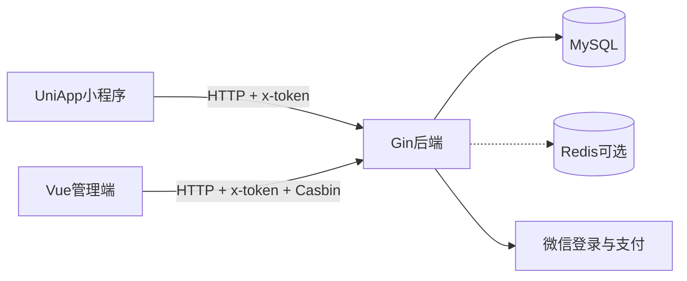

# 模块0：整体架构总览

> 目标：先建立「地图」，不讲表字段、不讲具体业务接口细节（那些在后续模块）。  
> 源码根：`old_shop/`（只读）。上游：[fevrax/fresh-shop-group](https://github.com/fevrax/fresh-shop-group.git)。

---

## 1. 这是什么项目

面向冻品/生鲜场景的全栈电商（品牌「启运冻品」），基于 [Gin-Vue-Admin](https://github.com/flipped-aurora/gin-vue-admin) 演进。  
你后续要做成**通用商城**，阶段一只弄清它现在怎么拼起来。

三端一体：

| 端 | 目录 | 技术 | 角色 |
|----|------|------|------|
| 后端 API | `old_shop/fresh-shop/server` | Go 1.23、Gin、GORM、JWT、Casbin、Swagger、微信 SDK | 唯一业务与数据中心 |
| 管理后台 | `old_shop/fresh-shop/web` | Vue3、Vite、Pinia、Element Plus、Axios | 运营/管理员：商品、订单、用户、权限 |
| 微信小程序 | `old_shop/fresh-shop-uniapp` | UniApp、uView、`uni.request` | C 端用户：浏览、加购、下单、支付 |

数据库脚本：`old_shop/fresh-shop/sql/fresh-shop.sql`（MySQL）。



---

## 2. 仓库目录怎么记

```
old_shop/
├── README.md                 # 启动说明
├── fresh-shop/
│   ├── server/               # 后端（核心）
│   ├── web/                  # 管理端
│   ├── sql/                  # 建库脚本
│   └── deploy/               # 部署
└── fresh-shop-uniapp/        # C 端小程序
```

后端里和「读业务」最相关的目录（其余可先忽略）：

| 目录 | 干什么 |
|------|--------|
| `server/main.go` | 进程入口：读配置 → 连库 → 起 HTTP |
| `server/config.yaml` | 端口、MySQL、Redis、微信、OSS 等 |
| `server/initialize/router.go` | **总路由注册**（公开/鉴权分组） |
| `server/router/` | 按域拆路由：`system` / `shop` / `account` / `business` / `wechat` |
| `server/api/v1/` | HTTP 入参出参（Controller） |
| `server/service/` | 业务逻辑 |
| `server/model/` | GORM 模型 / 请求响应结构 |
| `server/middleware/` | JWT、Casbin、操作日志等 |
| `server/docs/` | Swagger |

管理端：`web/src/api/`（接口封装）、`web/src/view/`（页面）、`web/src/pinia/`（状态）、`web/src/utils/request.js`（Axios）。

小程序：`api/`、`pages/`、`config/config.js`（后端地址）、`utils/request.js`。

---

## 3. 后端请求怎么走（分层）

典型一条业务请求：

```text
HTTP  →  router（路径+中间件）
      →  api/v1（解析参数、调 service）
      →  service（业务、事务）
      →  model / GORM → MySQL
```

你只要记住：**改行为看 service，加接口看 router + api，改表看 model + sql**。

---

## 4. 鉴权：Public vs Private

总开关在 [`server/initialize/router.go`](../../old_shop/fresh-shop/server/initialize/router.go)：

| 分组 | 中间件 | 含义 |
|------|--------|------|
| **PublicGroup** | 无 JWT / 无 Casbin | 未登录也能调（登录、验证码、商品列表/详情、分类品牌标签浏览、Banner、微信 code2Session、支付回调等） |
| **PrivateGroup** | `JWTAuth` + `CasbinHandler` | 必须带有效 Token；且角色要对 API 有 Casbin 权限 |

### 请求头（两端通用思路）

管理端 Axios（`web/src/utils/request.js`）会带：

- `x-token`：登录后 JWT  
- `x-user-id`：当前用户 ID  

Swagger 也声明鉴权头名为 `x-token`。

### 登录入口（公开）

挂在 `base` 下，无需 Token：

| 接口 | 用途 |
|------|------|
| `POST /base/login` | 管理端账号密码登录 |
| `POST /base/loginWx` | 微信侧登录（小程序） |
| `POST /base/captcha` | 验证码 |

### 公开业务（概念级，细节进后续模块）

注册在 Public 的常见能力：

- 商品：列表、详情（以及脚本里放在公开组的导入/导出——属实现细节，用时再看）
- 分类 / 品牌 / 标签：列表类查询
- Banner 列表
- 微信：`code2Session`、支付回调 `pay/notify`
- 系统公开配置、健康检查 `GET /health`

购物车、下单、支付参数创建、地址、收藏、后台 CRUD 等 → **Private**（要登录，管理端还要过权限）。

> 注意：Private 同时挂了 Casbin。小程序用户角色也要在权限体系里有对应 API 权限，否则会 401/无权限——这是 GVA 类项目的共性，模块4会再提。

---

## 5. 路由业务域（方便后面对号）

| 路由包 | 业务 |
|--------|------|
| `router/system` | 登录、用户、菜单、角色、Casbin、字典、配置、操作日志… |
| `router/shop` | 分类、品牌、标签、商品、购物车、订单、发货、退货、地址、收藏 |
| `router/account` | 账户、币种组、充值、财务流水 |
| `router/business` | Banner、配送员 |
| `router/wechat` | 小程序码、预支付参数、code2Session、支付回调 |
| `router/file`（example） | 上传下载 |

后续模块按「商品 → 购物车 → 订单 → 用户 → 账户 → 运营/系统」展开，都会回到这些包。

---

## 6. 配置与本地默认地址

| 项 | 位置 | 默认/说明 |
|----|------|-----------|
| 后端端口 | `server/config.yaml` → `system.addr` | **48888** |
| 路由前缀 | `system.router-prefix` | 空字符串（路径直接是 `/goods/...`） |
| 数据库 | `config.yaml` 中 mysql 段 | 需自建库并导入 `sql/fresh-shop.sql` |
| Redis | `system.use-redis` | 本地示例为 `false`（可关） |
| 管理端开发代理 | `web/.env.development` | 前端端口 `48088`，`VITE_BASE_API=/goapi` 代理到后端 |
| 小程序 API | `fresh-shop-uniapp/config/config.js` | `baseUrl: http://localhost:48888` |
| Swagger | 启动后 | `http://localhost:48888/swagger/index.html`（前缀若为空则路径如此） |

启动顺序（与 `old_shop/README.md` 一致）：导入 SQL → `go run main.go`（server）→ `npm run serve`（web）→ HBuilderX 跑小程序。  
默认管理账号（README）：`admin` / `123456`。

---

## 7. 管理端与小程序差异（架构层）

| | 管理端 web | 小程序 uniapp |
|--|------------|----------------|
| UI | Element Plus，动态菜单（后端下发） | 页面写在 `pages.json` |
| 鉴权后能力 | 强依赖 Casbin 角色菜单 | 以 C 端用户能力为主（下单支付） |
| 支付 | 后台多为查单、改状态、月结等 | `orderPay` + `uni.requestPayment` |
| 请求封装 | Axios + Pinia token | `uni.request` + 本地存 token |

两端都打同一个 Gin；**没有第二套后端**。

---

## 8. 启动时后端做了什么（点到为止）

[`server/main.go`](../../old_shop/fresh-shop/server/main.go) 大致顺序：

1. Viper 读 `config.yaml`  
2. 初始化日志、GORM（MySQL）  
3. 定时任务、微信客户端等  
4. `core.RunWindowsServer()` 起 Gin（内部会调 `initialize.Routers()`）

表结构以 SQL 脚本为准；代码里自动迁移默认注释掉（「本平台不使用」）。

---

## 9. 模块0你需要记住的结论

1. **一个后端 + 两个前端**，数据在 MySQL。  
2. 后端分层：`router → api → service → model`。  
3. **Public** 可匿名；**Private** 要 `x-token`，并过 Casbin。  
4. 业务域拆在 `shop` / `account` / `business` / `wechat` / `system`。  
5. 默认 API：`http://localhost:48888`。

---

## 下一模块预告

**模块1：商品** —— `shop_category` / `shop_brand` / `shop_goods` / 规格与图片等表的全字段，以及商品相关接口与「上架可售」流程。

确认本模块没问题后，回复：**下一模块** 或 **开始模块1**。
