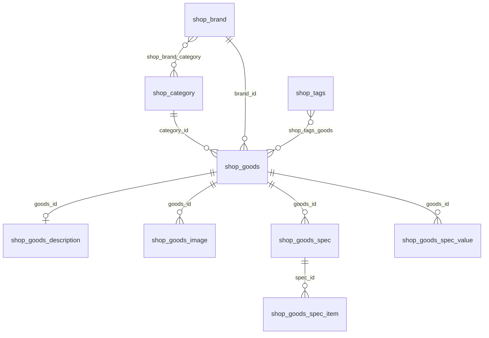

# 模块1：商品（表 · 接口 · 流程）

> 目标：搞清商品主数据如何存、如何被管理端维护、如何被小程序浏览。  
> SQL 依据：`old_shop/fresh-shop/sql/fresh-shop.sql`  
> 通用字段：`id`、`created_at`、`updated_at`、`deleted_at`（软删）各表类似，下文不重复展开。

---

## 1. 模块关系总览



读法：

- **分类 / 品牌 / 标签**：组织与筛选维度  
- **shop_goods**：商品主表（单规格时价格库存就在这里）  
- **description / image**：详情文案与轮播媒体  
- **spec / spec_item / spec_value**：多规格（SKU）三层结构（种子数据里规格表可能为空，但模型支持）

---

## 2. 表与字段

### 2.1 `shop_category` 商品分类

| 字段 | 类型 | 含义 |
|------|------|------|
| id | bigint | 主键 |
| pid | bigint | 上级分类 id，`0` 表示顶级 |
| title | varchar(10) | 分类名 |
| img_url | varchar(500) | 分类图 |
| sort | int | 排序，越小越靠前（业务里常见默认 50） |
| is_first | tinyint | 是否首页展示：`0` 否 / `1` 是 |

说明：支持树形（`pid`）；当前种子多为顶级冻品类目（鸡副、鸭副等）——二次开发时换成通用类目即可。

---

### 2.2 `shop_brand` 品牌

| 字段 | 类型 | 含义 |
|------|------|------|
| id | bigint | 主键 |
| name | varchar(20) | 品牌名 |
| logo | varchar(500) | Logo URL |
| sort | int | 排序 |

---

### 2.3 `shop_brand_category` 品牌↔分类

多对多中间表，无自增 id。

| 字段 | 含义 |
|------|------|
| brand_id | 品牌 |
| category_id | 分类 |

用途：某分类下筛品牌（接口有 `getBrandListByCategoryId`）。

---

### 2.4 `shop_tags` / `shop_tags_goods` 标签

**shop_tags**

| 字段 | 含义 |
|------|------|
| name | 标签名 |
| sort | 排序 |

**shop_tags_goods**

| 字段 | 含义 |
|------|------|
| goods_id | 商品 |
| tags_id | 标签 |

用于商品打标签、筛选（种子里关联可能较少）。

---

### 2.5 `shop_goods` 商品主表（核心）

| 字段 | 类型 | 含义 |
|------|------|------|
| name | varchar(255) | 商品名称 |
| category_id | bigint | 分类 id |
| brand_id | bigint | 品牌 id，`0` 可表示未选 |
| goods_area | tinyint | **区域**：`0` 普通商品 / `1` 积分商城 |
| spec_type | tinyint | **规格**：`0` 单规格 / `1` 多规格 |
| unit | varchar(20) | 单位（件、盒、袋…） |
| origin | varchar(255) | 产地 |
| cost_price | decimal(10,2) | 成本价 / 原价（积分场景也可表示积分价侧，见注释） |
| price | decimal(10,2) | 售价（优惠价）；单规格时用此字段 |
| min_count | int | 最低起购数量 |
| weight | int | 重量（克） |
| store | int | 库存；单规格时用此字段 |
| sale | int | 总销量（各规格汇总语义） |
| sort | int | 排序 |
| status | tinyint | **上架**：`0` 下架 / `1` 上架 |
| is_first | tinyint | 是否首页：`0`/`1` |
| is_hot | tinyint | 是否热销：`0`/`1` |
| is_new | tinyint | 是否上新：`0`/`1` |
| pay_count | int | 冗余字段；接口里可作「近期购买数量」等用途 |

模型里非表字段（查询时填充）：`isFavorite`、`cartNum`、`goodsCardId`、`images`、`spec` 等——方便详情接口一次返回。

---

### 2.6 `shop_goods_description` 详情文案

| 字段 | 含义 |
|------|------|
| goods_id | 商品 id |
| notice | 购买须知（文本/HTML） |
| details | 商品详情（富文本 HTML） |

与商品近似 1:1。

---

### 2.7 `shop_goods_image` 图片/视频

| 字段 | 含义 |
|------|------|
| goods_id | 商品 id |
| type | `0` 图片 / `1` 视频 |
| name | 文件名 |
| url | 访问地址 |
| sort | 排序 |

一个商品多条，列表页通常取首图。

---

### 2.8 多规格三表（`spec_type = 1` 时有意义）

**`shop_goods_spec`** — 规格维度（如「口味」「重量」）

| 字段 | 含义 |
|------|------|
| goods_id | 商品 |
| title | 规格名 |
| is_upload_image | 该项是否可上传图：`0`/`1` |
| sort | 排序 |

**`shop_goods_spec_item`** — 规格选项（如「香辣」「200g」）

| 字段 | 含义 |
|------|------|
| spec_id | 所属规格维度 |
| goods_id | 商品 |
| img_url | 选项图 |
| item | 选项文字 |
| sort | 排序 |

**`shop_goods_spec_value`** — SKU 组合（真正的价格库存行）

| 字段 | 含义 |
|------|------|
| goods_id | 商品 |
| item_ids | 规格项 id 组合，如 `1_2`（下划线拼接） |
| key_name | 中文展示，如 `口味:香辣,重量:200g` |
| price | 该 SKU 售价 |
| cost_price | 该 SKU 成本/原价 |
| store | 该 SKU 库存 |
| sale | 该 SKU 销量 |
| sort | 排序 |

说明：当前 SQL 种子里这三张表多为空，业务上大量商品是 **单规格**（`spec_type=0`，价格库存在 `shop_goods`）。接单时若客户要颜色尺码，走这三张表。

---

## 3. 接口地图

路由前缀默认空；完整路径如 `/goods/getGoodsList`。  
注册见 `server/initialize/router.go` + `server/router/shop/*.go`。

### 3.1 商品 Goods

| 方法 | 路径 | 分组 | 用途 |
|------|------|------|------|
| GET | `/goods/getGoodsList` | Public | 分页/筛选列表（小程序、管理端都用） |
| GET | `/goods/findGoods` | Public | 详情（含图、规格等） |
| POST | `/goods/createGoods` | Private | 新建 |
| PUT | `/goods/updateGoods` | Private | 更新 |
| DELETE | `/goods/deleteGoods` | Private | 删除 |
| DELETE | `/goods/deleteGoodsByIds` | Private | 批量删 |
| POST | `/goods/batchCreateGoodsByExcel` | Public* | Excel 导入 |
| POST | `/goods/exportGoods` | Public* | 导出 |

\* 导入导出挂在 Public 路由组（实现如此）；生产环境应靠网关/权限收紧，二次开发时可改为 Private。

### 3.2 分类 Category

| 方法 | 路径 | 分组 | 用途 |
|------|------|------|------|
| GET | `/category/getCategoryList` | Public | 分页列表 |
| GET | `/category/getCategoryListAll` | Public | 全部（树/下拉） |
| GET | `/category/findCategory` | Public | 单条 |
| POST/PUT/DELETE | `/category/createCategory` 等 | Private | 维护 |

### 3.3 品牌 Brand

| 方法 | 路径 | 分组 | 用途 |
|------|------|------|------|
| GET | `/brand/getBrandList` | Public | 分页 |
| GET | `/brand/getBrandListAll` | Public | 全部 |
| GET | `/brand/getBrandListByCategoryId` | Public | 按分类筛品牌 |
| GET | `/brand/findBrand` | Public | 单条 |
| POST/PUT/DELETE | `/brand/...` | Private | 维护 |
| POST | `/brandCategory/createBrandCategory` | Private | 维护品牌-分类关系 |

### 3.4 标签 Tags

| 方法 | 路径 | 分组 | 用途 |
|------|------|------|------|
| GET | `/tags/getTagsList`、`getTagsListAll`、`findTags` | Public | 查询 |
| POST/PUT/DELETE | `/tags/...` | Private | 维护 |

### 3.5 调用端对照

| 端 | 典型用途 |
|----|----------|
| 小程序 | 公开列表/详情/分类；`api/goods.js` 等 |
| 管理端 | CRUD + Excel；`web/src/api/goods.js`、`view/shop/goods/` |

Swagger：`http://127.0.0.1:48888/swagger/index.html` 可搜 `goods` / `category`。

---

## 4. 关键流程

### 4.1 管理端新建单规格商品（最常见）

```text
填写名称、分类、品牌、单位、价格、库存、上下架、首页/热销标记
  → 上传图片 → 写详情
  → POST /goods/createGoods
  → 写入 shop_goods + shop_goods_image + shop_goods_description
  → spec_type = 0，价格库存落在 shop_goods
```

### 4.2 多规格商品（模型能力）

```text
spec_type = 1
  → 建 shop_goods_spec（维度）
  → 建 shop_goods_spec_item（选项）
  → 建 shop_goods_spec_value（每个组合的价格库存）
  → 主表 store/price 可能作汇总或展示用，下单以 SKU 行为准（订单模块再细讲）
```

### 4.3 小程序浏览

```text
打开分类页 → GET 分类列表
  → GET /goods/getGoodsList（categoryId / isHot / isNew / goodsArea / name…）
  → 点商品 → GET /goods/findGoods?id=
  → 展示图、价、详情；未登录一般也能看（Public）
```

列表过滤直觉（具体以 service 查询条件为准）：

- `status=1` 上架才卖  
- `goods_area=0` 普通区；`=1` 积分商城  
- `is_first` / `is_hot` / `is_new` 对应首页运营位  

### 4.4 与后续模块的衔接

- 加购 → `shop_cart.goods_id`（+ 多规格时 `spec_item_id`）→ **模块2**  
- 下单明细会冗余商品名、图、价 → **模块3**  

---

## 5. 源码锚点（Go 开发者速查）

| 层级 | 路径 |
|------|------|
| 路由 | `old_shop/fresh-shop/server/router/shop/goods.go` 等 |
| API | `server/api/v1/shop/goods.go` |
| Service | `server/service/shop/` 下 goods/category… |
| Model | `server/model/shop/goods.go` 等 |
| 管理端页 | `web/src/view/shop/goods/`、`category/`、`brand/`、`tags/` |
| 管理端 API | `web/src/api/goods.js` 等 |
| 小程序 | `fresh-shop-uniapp/pages/goods/`、`pages/category/`、`api/goods.js` |

建议精读顺序：`model/shop/goods.go` → `router/shop/goods.go` → `service` 里 `GetGoodsList` / `CreateGoods`。

---

## 6. 二次开发提示（通用商城）

- 分类/品牌种子换成客户行业数据即可，表结构可复用  
- `goods_area`（积分商城）做成配置开关，默认只用 `0`  
- 多规格三表保留，即使首期客户只用单规格  
- 导入导出接口建议改为需登录 + 权限  

---

## 7. 本模块过关自测

1. 单规格商品的价格、库存在哪张表的哪些字段？  
2. 多规格时 SKU 价格库存在哪张表？`item_ids` 是什么意思？  
3. `goods_area`、`spec_type`、`status` 枚举分别是什么？  
4. 小程序拉列表、看详情走哪些接口？要不要登录？  
5. 品牌和分类如何多对多关联？  

能答上来即可进入模块2。对照方式：管理端打开「商品管理」新建/编辑一件商品，同时看库表变化；小程序看分类与商品列表请求。

---

确认本模块没问题后，回复：**下一模块** 或 **开始模块2**（购物车）。
