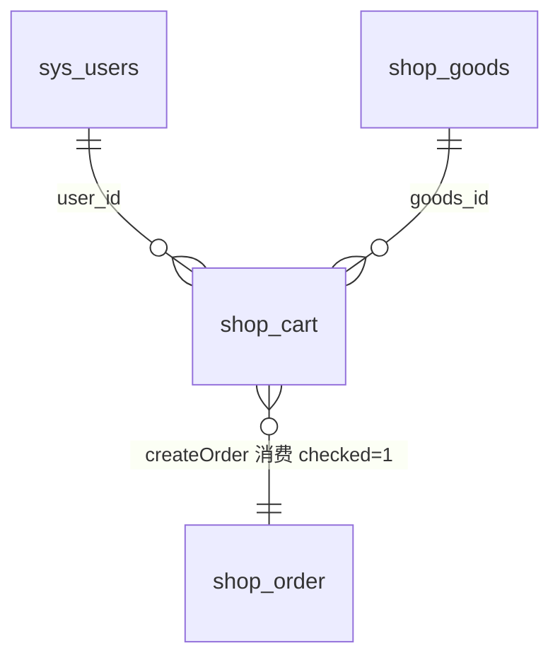
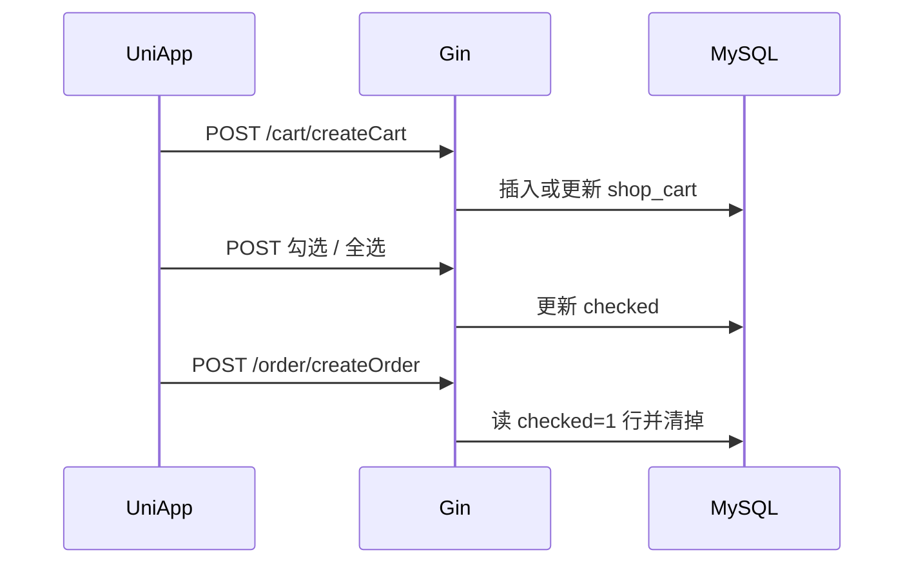

# 模块2：购物车（表 · 接口 · 流程）

> 目标：搞清加购、改数量、勾选如何落库，以及和商品、下单的衔接。  
> 表：`shop_cart`。下单只取 **`checked = 1`** 的行（见 [03a-order-pay.md](./03a-order-pay.md)）。  
> 主源码：`server/service/shop/cart.go`、`server/router/shop/cart.go`。

---

## 1. 模块关系



- 购物车是 **用户维度的临时选购清单**（需登录）  
- 一行 ≈「某用户 + 某商品（当前实现基本按单规格合并）」  
- `checked` 标记是否参与结算；`createOrder` 只拉已勾选行  

---

## 2. 表与字段：`shop_cart`

| 字段 | 类型 | 含义 |
|------|------|------|
| id | bigint | 主键 |
| created_at / updated_at / deleted_at | datetime | 通用；软删 |
| goods_id | bigint | 商品 id → `shop_goods.id` |
| user_id | bigint | 用户 id → `sys_users.id` |
| spec_type | tinyint | `0` 单规格 / `1` 多规格（表有字段） |
| spec_item_id | bigint | 规格相关 id；**当前 CreateCart 强制写成 0** |
| num | int | 数量 |
| checked | tinyint | **是否选中结算**：`0` 否 / `1` 是 |

模型关联：`Goods Goods`（查询时常 `Preload("Goods")` / `Preload("Goods.Images")`）。

说明：多规格字段预留了，加购逻辑里尚未按 SKU 拆行（与订单侧「先做单规格」一致）。

---

## 3. 接口地图

全部挂在 **Private**（要 JWT；并过 Casbin）。前缀默认空，路径如 `/cart/createCart`。

| 方法 | 路径 | 用途 |
|------|------|------|
| POST | `/cart/createCart` | 加购 / 改数量（同用户同商品合并） |
| PUT | `/cart/updateCart` | 主要更新勾选 `checked`（会校验库存） |
| DELETE | `/cart/deleteCart` | 删一条 |
| DELETE | `/cart/deleteCartByIds` | 按 id 批量删 |
| GET | `/cart/getCartList` | 当前用户购物车列表；可选 `checked` 筛选 |
| POST | `/cart/selectAllChecked` | 全选（库存不足的跳过） |
| POST | `/cart/clearAllChecked` | 取消全选 |
| POST | `/cart/selectGoodsSingeChecked` | 「只选这一件」：先全不选，再加购/改数量并勾选 |

小程序：`fresh-shop-uniapp/api/cart.js`（`addCart`、`getCartList`、`getCheckedCartList`、`updateCart`、全选/取消、批量删）。

管理端有 `web/src/api/cart.js`，一般无独立「购物车管理页」（C 端能力）。

---

## 4. 关键流程

### 4.1 加购 `CreateCart`

```text
1. 校验商品存在
2. SpecItemId 置 0（当前实现）
3. 查是否已有：user_id + goods_id
   - 无记录
       · 校验 store >= num
       · num>0 则 Create 新行
   - 已有：
       · 若新 num 更大，再校验库存
       · num==0 → Delete 该行
       · 否则更新 num、checked
```

因此：**同一用户同一商品只有一行**，重复加购是改数量，不是多行。

`userId` 由 token 注入，不信任前端乱传。

### 4.2 改勾选 `UpdateCart`

- 按购物车 `id` 加载，Preload 商品  
- 若设为 `checked=1`：库存必须 `>0` 且 `>= num`，否则报「库存不足」  
- 只持久化勾选状态（本实现重点在 `Checked`）

### 4.3 全选 / 取消全选 / 单选

- **全选**：列出该用户所有车内商品；库存为 0 或不足 `num` 的**不勾选**；其余 `checked=1`  
- **取消全选**：该用户全部 `checked=0`  
- **单选** `selectGoodsSingeChecked`：先 `ClearAllChecked`，再带着 `goodsId`+`num` 走 `CreateCart`，并设 `checked=1`（效果是购物车里只勾这一件；实现上是「清空勾选 + 加购/改数量」）

### 4.4 列表 `GetCartList`

```text
WHERE user_id = 当前用户
  · 可选 checked 条件
  · Preload Goods.Images
  · 按 created_at desc
返回前：若商品已删或库存不足 → 强制 checked=0 并回写库
过滤掉 Goods.ID==0 的脏数据
```

前端「只要已选」：带 `checked=1` 调同一列表接口（见 `getCheckedCartList`）。

### 4.5 和下单的衔接（模块 3a）

```text
用户勾选商品（checked=1）
  → POST /order/createOrder
  → 服务端：WHERE user_id=? AND checked=1
  → 生成订单明细、扣库存、Delete 这些购物车行
```

未勾选行仍留在车里。



---

## 5. 源码锚点

| 层级 | 路径 |
|------|------|
| 路由 | `server/router/shop/cart.go` |
| API | `server/api/v1/shop/cart.go` |
| Service | `server/service/shop/cart.go` |
| Model | `server/model/shop/cart.go` |
| 小程序 API | `fresh-shop-uniapp/api/cart.js` |
| 小程序页 | `pages/cart/`、`components/shopCart/` |

建议精读：`CreateCart` → `GetCartInfoList` → 再对照 `order.go` 的 `CreateOrder` 里查购物车那段。

---

## 6. 二次开发提示

- 多规格：应按 `goods_id + spec` 维度拆行，不要写死 `SpecItemId=0`  
- 未登录加购：现框架必须登录；通用版可加本地车再登录合并（当前无）  
- 库存不足在列表里自动取消勾选，体验合理，接单时可保留  
- 与支付文档一致：建单即扣库存，取消/超时回滚要在订单侧补（见 [payment-reliability.md](./payment-reliability.md)）  

---

## 7. 本模块过关自测

1. `checked` 含义是什么？下单读的是哪些行？  
2. 同一用户对同一商品加购两次，库里几行？数量怎么变？  
3. `num=0` 调 `createCart` 会发生什么？  
4. 全选时为什么有的商品勾不上？  
5. 列表接口为何可能把 `checked` 改回 0？  

能答即可进入模块 3a（若已读 3a，可回头用购物车串一遍下单）。
