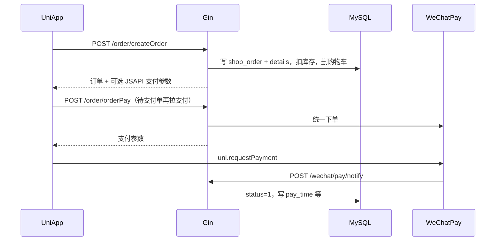

# 模块 3a：订单 · 下单与支付

> 目标：搞清「从购物车到支付成功」涉及的表、接口与状态变化。  
> 履约（发货/收货/退货/月结批量）见 [03b-order-fulfillment.md](./03b-order-fulfillment.md)。  
> 主源码：`old_shop/fresh-shop/server/service/shop/order.go`、`service/wechat/wechat.go`。

---

## 1. 范围与关系

本模块只盯：

- 表：`shop_order`、`shop_order_details`
- 入口：`createOrder`、`orderPay`、`cancelOrder`（未支付阶段）、微信回调 `pay/notify`
- 上游依赖：购物车勾选（`shop_cart.checked=1`）、收货地址（`user_address`）、商品库存



---

## 2. 表与字段

### 2.1 `shop_order` 订单主表

| 字段 | 类型 | 含义 |
|------|------|------|
| user_id | bigint | 下单用户 |
| order_sn | varchar(50) | 订单号（如 `SN...`，回调按此对账） |
| goods_area | tinyint | `0` 普通 / `1` 积分商城 |
| shipment_name | varchar(20) | 收货人姓名（代码里可能拼先生/女士） |
| shipment_mobile | varchar(11) | 收货手机 |
| shipment_address | varchar(255) | 收货地址全文 |
| shipment_type | tinyint | `0` 配送 / `1` 自提 |
| num | int | 商品总件数 |
| total | decimal | 商品总金额（下单计算） |
| finish | decimal | **实付金额**（支付成功后写入） |
| postage | decimal | 邮费 |
| pick_up_number | int | 自提取餐号 |
| settlement_type | tinyint | `0` 现结 / `1` 月结未结 / `2` 月结已结 |
| status | tinyint | 见下方状态机（本模块重点 `0→1`） |
| payment | tinyint | 支付方式，见枚举 |
| payment_info | varchar | 支付附加信息 |
| payment_openid | varchar | 支付用 openId |
| transation_id | varchar | 微信交易号（字段名拼写如此） |
| gift_points | decimal | 预计赠送积分 |
| remarks | varchar | 买家留言 |
| status_cancel | tinyint | `0` 未取消 / `1` 用户 / `2` 后台 / `3` 超时 |
| status_refund | tinyint | `0` 未退 / `1` 退款中 / `2` 已退 / `3` 失败 |
| pay_time | datetime | 支付时间 |
| shipment_time / receive_time / cancel_time | datetime | 发货/收货/取消时间（3b） |

非表字段（请求用）：`addressId`（收货地址 id）、`pointGoodsId`（积分商品直购）、`details` 等。

#### 订单状态 `status`（本模块）

| 值 | 含义 | 本模块是否涉及 |
|----|------|----------------|
| 0 | 未付款 | 建单后零售微信待付 |
| 1 | 已付款待发货 | 支付成功 / 积分单 / 月结建单 |
| 2 | 已发货 | → 3b |
| 3 | 已收货 | → 3b |

#### 支付方式 `payment`

| 值 | 含义 |
|----|------|
| 1 | 余额 |
| 2 | 微信 |
| 3 | 支付宝 |
| 4 | 积分 |
| 5 | 线下支付（月结客户建单时用） |

#### 建单时角色如何定状态（实现逻辑）

代码按用户 `authority_id` 分支（`CreateOrder`）：

| 条件 | status | payment | settlement_type | 说明 |
|------|--------|---------|-----------------|------|
| `pointGoodsId > 0` | 1 | 4 | — | 积分商品，建单即已付并扣积分 |
| `authority_id == 1001` | 1 | 5 | 1 | 月结客户，建单即「已付」语义，线下/月结 |
| 其他（如 1000 零售） | 0 | 2 | 0 | 待微信支付 |

零售且非积分：建单成功后若 `authority_id == 1000`，会立刻调 `JSAPIPay`，响应里可带支付参数；也可之后再调 `orderPay`。

---

### 2.2 `shop_order_details` 订单明细

下单时从商品/购物车**冗余拷贝**，避免以后改价影响历史单。

| 字段 | 含义 |
|------|------|
| goods_id | 商品 id |
| order_id | 所属订单 |
| spec_id | 规格 id（当前实现多为 `0`，注释写多规格未完全做） |
| spec_key_name | 规格展示文案（现常用重量/单位拼出来） |
| goods_name / goods_image / unit | 名称、图、单位快照 |
| num | 数量 |
| price | 单价快照 |
| total | 该行小计 |
| gift_points | 该行赠送积分 |

---

## 3. 接口地图

均需登录（Private：JWT + Casbin），支付回调除外。

| 方法 | 路径 | 鉴权 | 用途 |
|------|------|------|------|
| POST | `/order/createOrder` | Private | 创建订单；零售可顺带返回微信 JSAPI 参数 |
| POST | `/order/orderPay` | Private | 对**未支付**订单再拉微信 JSAPI 参数 |
| POST | `/order/cancelOrder` | Private | 取消；`status >= 2` 不允许 |
| POST | `/wechat/pay/notify` | **Public** | 微信支付结果回调 |
| POST | `/wechat/createPayData` | Private | 注释写明「暂时无用」，主路径不依赖 |

小程序封装：`fresh-shop-uniapp/api/order.js` → `createOrder` / `orderPay`。

请求要点：

- `createOrder`：JSON 绑定 `shop.Order`；`addressId` 在配送（`shipmentType=0`）时必填；`userId` 由 token 注入。  
- `orderPay`：至少带订单 `id`；用当前用户 `openId` 调微信。

---

## 4. 核心流程

### 4.1 创建订单 `CreateOrder`（普通零售）

```text
1. 查用户
2. 若 addressId>0：查 user_address，拼收货信息
3. 拉购物车：user_id + checked=1，Preload Goods.Images
   （或 pointGoodsId：积分商品直购一条「伪购物车」）
4. 校验库存：cart.num <= goods.store
5. 算 order.num / order.total（优惠价规则：price>0 且 < costPrice 用 price，否则用 costPrice）
6. 组装 order_details 列表（名、图、价、数量、积分等）
7. 生成 order_sn；按角色设置 status/payment/settlement_type
8. 事务意图内：
   - Create order
   - Create details
   - 扣减 goods.store
   - 非积分单：Delete 已选购物车
   - 积分单：扣积分账户
9. 零售(1000)且非积分：JSAPIPay → 返回 { order, pay }
```

注意：实现里 `Begin()` 后部分写库仍用 `global.DB`，学习时抓住业务步骤即可；二次开发可收紧为真正事务。

### 4.2 再次支付 `OrderPay`

```text
订单存在且 status==0
  → wechat.JSAPIPay(openId, orderSn, orderId, total, clientIP)
  → 返回支付参数给小程序 uni.requestPayment
```

已支付（`status==1`）或其它状态会直接报错。

### 4.3 支付回调 `PayNotify` → `NotifyLogic`

```text
1. 收微信 XML，验签
2. ReturnCode/ResultCode 均为 SUCCESS
3. 按 out_trade_no（即 order_sn）查订单
4. 若已是 status=1：直接成功返回（幂等）
5. 若 status!=0：失败
6. 写入 finish、status=1、pay_time、payment_openid、payment_info、transation_id
7. 应答微信 SUCCESS
```

回调 URL 配在 `config.yaml` → `wechatPay.notifyUrl`，需公网可达；纯本机调试通常要内网穿透。

### 4.4 取消 `CancelOrder`（未发货前）

- `status >= 2`：不允许取消  
- 否则写 `status_cancel`、`cancel_time`  
- 注释提到已支付需退款，当前实现以改取消状态为主（退款细节可结合 3b / 支付文档再挖）

---

## 5. 状态怎么变（本模块）

```text
[建单·零售微信] status=0, payment=2
        │
        │  requestPayment 成功 + notify
        ▼
[已支付待发货] status=1，finish/pay_time/流水号等有值
        │
        └──► 发货等见 03b

[建单·积分/月结] 直接 status=1（不走微信回调）
```

---

## 6. 源码锚点

| 层级 | 路径 |
|------|------|
| 路由 | `server/router/shop/order.go`、`router/wechat/wechat.go` |
| API | `server/api/v1/shop/order.go`（CreateOrder / OrderPay / CancelOrder） |
| 业务 | `server/service/shop/order.go` → `CreateOrder`、`OrderPay`、`CancelOrder` |
| 微信 | `server/service/wechat/wechat.go` → `JSAPIPay`、`NotifyLogic` |
| 模型 | `server/model/shop/order.go`、`order_details.go` |
| 小程序 | `fresh-shop-uniapp/api/order.js`，下单页 `pages/order/submit.vue` 等 |

建议阅读顺序：`CreateOrder` 全文 → `OrderPay` → `NotifyLogic` → 小程序 `createOrder` 后如何调 `requestPayment`。

---

## 7. 二次开发提示

- 通用 B2C：默认走「status=0 → 微信 → 回调 status=1」；月结（1001）、积分可做成开关  
- `notifyUrl`、商户号按客户配置隔离（单商户独立部署）  
- 多规格下单：当前明细里 `spec_id` 基本未用满，接单若要 SKU 需补齐  
- 建单事务建议二次开发时改干净，避免扣库存与订单不一致  

---

## 8. 本模块过关自测

1. 零售微信单建单后 `status`、`payment` 各是什么？支付成功后谁改成 `1`？  
2. `order_sn` 在回调里起什么作用？  
3. 明细表为什么要冗余 `goods_name`、`price`？  
4. `createOrder` 和 `orderPay` 分别什么时机用？  
5. 积分单、月结单为何可能不走 `pay/notify`？  

能答即可；履约与退货等 **下一模块 3b**。若要先补购物车（模块2）也可以说一声。

---

## 附录：支付异常与二次开发

主路径之外的能力边界（掉单、对账、退款、超时冲突等）见：

→ [payment-reliability.md](./payment-reliability.md)
