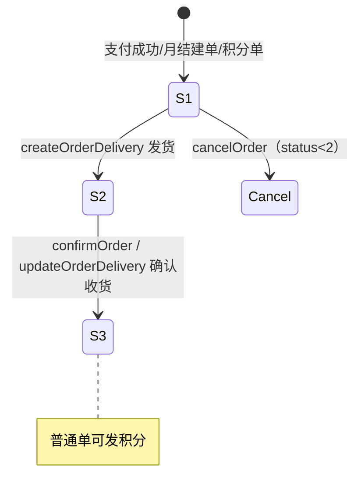
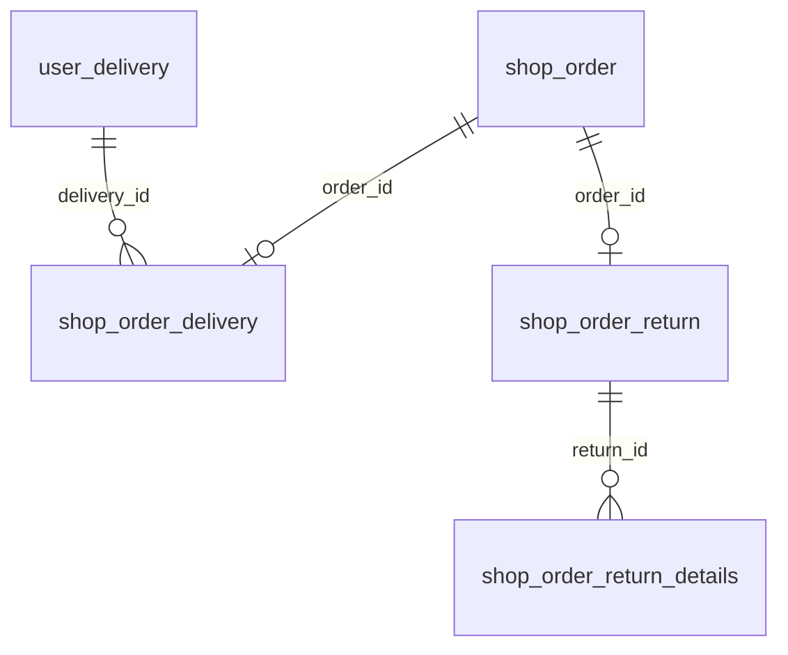
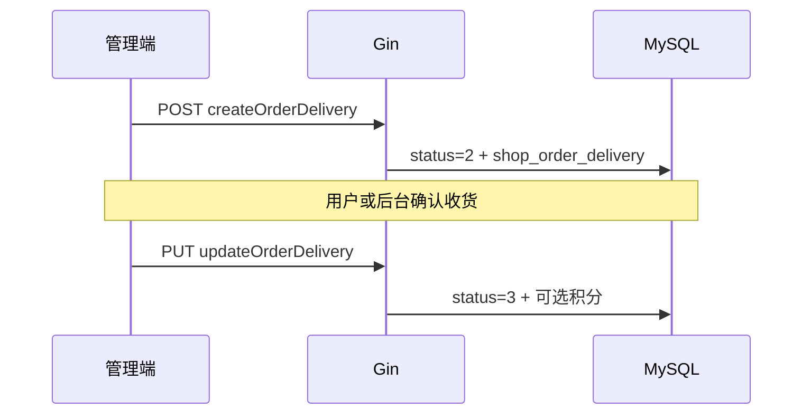

# 模块 3b：订单 · 履约与退货

> 目标：搞清「已支付之后」发货、收货、取消、售后、月结结算改哪些表与状态。  
> 前置：[03a-order-pay.md](./03a-order-pay.md)（`status=0→1`）。支付异常补全见 [payment-reliability.md](./payment-reliability.md)。  
> 主源码：`service/shop/order_delivery.go`、`order_return.go`、`order.go`（Cancel / BatchSettlement）。

---

## 1. 范围与关系

本模块盯：

- 表：`shop_order`（续）、`shop_order_delivery`、`shop_order_return`、`shop_order_return_details`；关联 `user_delivery`（配送员）
- 主路径：`status 1 → 2 → 3`（待发货 → 已发货 → 已收货）
- 旁路：取消（`status_cancel`）、售后单、月结批量结算（`settlement_type`）







---

## 2. 表与字段

### 2.1 `shop_order`（履约相关字段）


| 字段                          | 含义（本模块）                                     |
| --------------------------- | ------------------------------------------- |
| status                      | `1` 待发货 → `2` 已发货 → `3` 已收货                 |
| shipment_time               | 发货时间（发货时写）                                  |
| receive_time                | 收货时间（确认收货时写）                                |
| cancel_time / status_cancel | 取消时间 / 取消类型：`0` 未取消 `1` 用户 `2` 后台 `3` 超时    |
| status_refund               | `0` 未退 `1` 退款中 `2` 已退 `3` 失败（**字段有，业务闭环弱**） |
| settlement_type             | `0` 现结 `1` 月结未结 `2` 月结已结                    |
| gift_points                 | 下单时算好的赠送积分；**确认收货**时发放（普通商品）                |
| goods_area                  | `0` 普通才发积分；`1` 积分商城不发                       |


关联（查询常 Preload）：`OrderDelivery`、`OrderReturn`、`OrderDetails`。

列表筛选用 `status=10` 表示「有售后关联」的订单（Join `OrderReturn`），不是 `shop_order.status` 真写成 10。

### 2.2 `shop_order_delivery` 发货/配送单


| 字段                            | 含义                                 |
| ----------------------------- | ---------------------------------- |
| order_id                      | 订单 id                              |
| scheduled_time                | 预计到达时间                             |
| deliver_name / deliver_mobile | 送货人姓名/电话（可手工填）                     |
| delivery_id                   | 配送员 id → `user_delivery.id`（可选）    |
| receipt_time                  | 收货时间（确认收货时写入；并同步订单 `receive_time`） |


一单一条发货记录（实现按订单创建）。

### 2.3 `user_delivery` 配送员（业务表，模块 6 也会提）


| 字段            | 含义                             |
| ------------- | ------------------------------ |
| name / mobile | 姓名/手机                          |
| deliver_count | 送货单数（确认收货且带了 delivery_id 时 +1） |
| status        | `0` 禁用 `1` 启用                  |


### 2.4 `shop_order_return` / `shop_order_return_details` 售后

`**shop_order_return**`


| 字段                   | 含义                                 |
| -------------------- | ---------------------------------- |
| user_id / order_id   | 用户、订单                              |
| reason               | 申请原因                               |
| amount               | 退款金额                               |
| status               | 售后处理：`-1` 拒绝 `0` 未处理 `1` 已退款（模型注释） |
| refund_status        | 退款状态（另字段，与订单 `status_refund` 未强绑定） |
| reply / process_time | 售后说明、处理时间                          |


`**shop_order_return_details**`


| 字段              | 含义      |
| --------------- | ------- |
| return_id       | 售后单 id  |
| order_detail_id | 订单明细 id |
| num             | 申请售后数量  |


当前 Service 基本是 **CRUD 脚手架**，没有「申请→改订单 status_refund→微信退款→回库存」的完整流程。  
待补项已记入 **[todo-gaps.md](./todo-gaps.md)**（PAY-05 / FUL-01）；支付侧总表见 [payment-reliability.md](./payment-reliability.md)。

---

## 3. 接口地图

### 3.1 发货 / 收货（`/orderDelivery`）


| 方法     | 路径                                    | 用途                                          |
| ------ | ------------------------------------- | ------------------------------------------- |
| POST   | `/orderDelivery/createOrderDelivery`  | **发货**：写配送单，订单 `status=2`，写 `shipment_time` |
| PUT    | `/orderDelivery/updateOrderDelivery`  | **确认收货**：`status=3`，写收货时间；可发积分、配送员计数 +1     |
| GET    | `/orderDelivery/findOrderDelivery`    | 按 id 或 orderId 查                            |
| GET    | `/orderDelivery/getOrderDeliveryList` | 列表                                          |
| DELETE | …                                     | 删配送记录（慎用，无回滚订单状态）                           |


前置条件：

- 发货：订单须 `status=1` 且 `status_cancel=0`
- 收货：订单须 `status=2` 且 `status_cancel=0`；请求里要带 `receiptTime` 才会把订单置为 3

管理端：订单页「发货」弹窗选配送员 → `createOrderDelivery`（见 `web/.../order/order.vue`、`orderMonth.vue`）。

### 3.2 订单侧（`/order`，本模块相关）


| 方法   | 路径                               | 用途                                            |
| ---- | -------------------------------- | --------------------------------------------- |
| POST | `/order/cancelOrder`             | 取消；`status>=2` 不允许                            |
| POST | `/order/confirmOrder`            | C 端确认收货；`status=2 AND status_cancel=0` → `3`   |
| POST | `/order/batchSettlement`         | 月结批量：某用户某月 `settlement_type 1→2`，并写 `payment` |
| GET  | `/order/getOrderList` 等          | 列表可筛 status / 月结 / 售后(10)                     |
| GET  | `/order/findUserOrderStatus`     | 各状态数量 + 月结统计                                  |
| GET  | `/order/getOrderMonthStatistics` | 月结统计                                          |


注意：`OrderService.OrderDeliver` **空实现**；真正发货走 `CreateOrderDelivery`，不要误读空函数。

### 3.3 售后（`/orderReturn`）


| 方法     | 路径                               | 用途        |
| ------ | -------------------------------- | --------- |
| POST   | `/orderReturn/createOrderReturn` | 创建售后单     |
| PUT    | `/orderReturn/updateOrderReturn` | 更新（含处理状态） |
| GET    | find / list                      | 查询        |
| DELETE | …                                | 删除        |


另有 `orderReturnDetails` CRUD（明细）。**不会自动调微信退款、不会自动改 `shop_order.status_refund`。**

### 3.4 小程序注意

小程序 `confirmOrder` 打 **`POST /order/confirmOrder`**（body `{ ID: 订单id }`）。**v0.3.0 已补齐该路由**（条件更新 `status=2→3`）。管理端仍走 `PUT /orderDelivery/updateOrderDelivery`。详见 [features/fulfillment/v0.3.0](./features/fulfillment/v0.3.0/)。

---

## 4. 关键流程

### 4.1 发货 `CreateOrderDelivery`

```text
1. 查订单：id = orderId AND status=1 AND status_cancel=0
2. 事务：
   · 订单 status=2，shipment_time=now
   · Insert shop_order_delivery（预计时间、送货人、delivery_id 等）
```

注意：步骤 1 在事务外，与 `CancelOrder` 之间存在竞态（可能已取消仍发货或覆盖取消标记）。待补：**[todo-gaps.md](./todo-gaps.md) FUL-05**（乐观锁 `version` / 条件更新）。

行业色彩：用「配送员 + 预计到达」而不是快递单号——适合冻品城配；通用商城可改成物流公司 + 运单号。

### 4.2 确认收货

C 端：`POST /order/confirmOrder`（`{ ID }`，服务端写 `receive_time=now`）。  
管理端：`PUT /orderDelivery/updateOrderDelivery`（须带 `receiptTime` 才完结）。

两边订单写入均为条件更新：`status=2 AND status_cancel=0` → `status=3`；有发货单则写 `receipt_time`，`delivery_id>0` 则 `deliver_count+1`；`goods_area==0` 且 `gift_points>0` 发积分。无 `receiptTime` 的管理端请求只改发货单、不完结订单。

### 4.3 取消 `CancelOrder`

```text
1. 订单存在
2. status >= 2 → 拒绝（已发货/已收货不可取消）
3. 写 status_cancel（默认 1 用户；后台可传 2/3）、cancel_time
```

注释写「已支付需退款」，**实现没有**：不调微信退款、不回库存、不改 `status_refund`。详见 [payment-reliability.md](./payment-reliability.md)。

### 4.4 月结批量结算 `BatchSettlement`

```text
条件：user_id + 指定自然月 + status>0 + status_cancel=0
      + settlement_type=1 + status_refund=0
更新：settlement_type=2，payment=传入的支付方式
```

是「把该月未结月结单标成已结」，不是逐单微信支付。

### 4.5 售后（现状）

```text
createOrderReturn → 插售后主表（及前端是否带 details）
updateOrderReturn → 改 status / reply 等
```

无与支付/库存/订单主状态机的强制联动。二次开发要补的闭环：同意退款 → 微信退款 API → `status_refund` → 视情况回库存（清单：[todo-gaps.md](./todo-gaps.md)）。




---

## 5. 源码锚点


| 层级      | 路径                                                               |
| ------- | ---------------------------------------------------------------- |
| 发货路由/服务 | `router/shop/order_delivery.go`、`service/shop/order_delivery.go` |
| 售后      | `router/shop/order_return.go`、`service/shop/order_return.go`     |
| 取消/月结   | `service/shop/order.go` → `CancelOrder`、`BatchSettlement`        |
| 模型      | `model/shop/order*.go`、`model/business/user_delivery.go`         |
| 管理端     | `web/src/view/shop/order/order.vue`（发货弹窗）、`orderMonth.vue`       |
| 小程序     | `pages/order/`、`api/order.js`（注意 confirm 路径）                     |


建议精读顺序：`CreateOrderDelivery` → `UpdateOrderDelivery` → `CancelOrder` → 扫一眼 `CreateOrderReturn`（感受「仅 CRUD」）。

---

## 6. 行业耦合 vs 通用二次开发


| 现状（冻品/小 B）                               | 通用单商户可怎么做               |
| ---------------------------------------- | ----------------------- |
| 配送员 `user_delivery` + 预计到达               | 可保留城配；或换成快递单号字段         |
| 月结 `settlement_type` + `batchSettlement` | B2C 可隐藏；接小 B 客户再开       |
| 用户审核 `audit_status`（模块 4）                | 与履约弱相关，通用可关掉            |
| 售后仅脚手架                                   | **接单前建议补**：退款 + 状态 + 库存 |
| 取消不回库存/不退款                               | 与支付可靠性文档一并补             |


---

## 7. 本模块过关自测

1. `status` 从 1 到 3，分别由哪个接口改？写哪些时间字段？
2. 发货对订单状态有什么前置条件？
3. 确认收货时积分什么时候发？积分商品发吗？
4. `cancelOrder` 在已发货后能否取消？会不会退款、回库存？
5. `shop_order_return` 与 `status_refund` 现在有没有自动联动？
6. `batchSettlement` 改的是什么字段？适用于哪类客户？

能答即可进入 **模块 4**（用户/登录/地址）。