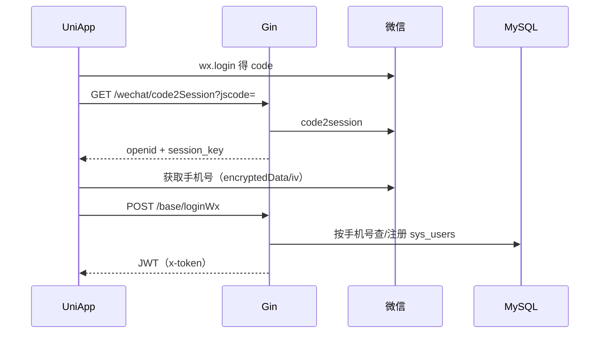
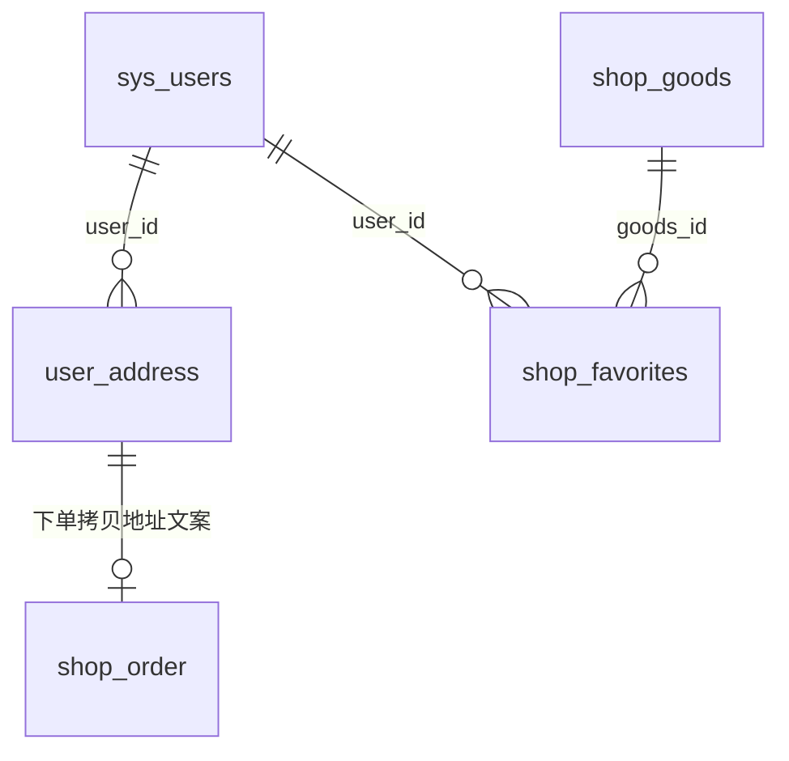

# 模块4：用户 · 登录 · 地址 · 收藏

> 目标：分清管理端账号登录与小程序微信登录，以及 `sys_users`、收货地址、收藏如何支撑下单。  
> 账户余额/充值见 [05-account.md](./05-account.md)（注册时会顺带建账户）。  
> 主源码：`service/system/sys_user.go`、`api/v1/system/sys_user.go`（Login / LoginWx）、`service/shop/user_address.go`、`favorites.go`。

---

## 1. 范围与关系

本模块盯：

- 表：`sys_users`、`user_address`、`shop_favorites`
- 登录：`POST /base/login`（管理端）、`GET /wechat/code2Session` + `POST /base/loginWx`（小程序）
- 地址 / 收藏 CRUD（Private，JWT）





---

## 2. 表与字段

### 2.1 `sys_users`（C 端与管理端共用一张用户表）

| 字段 | 含义 |
|------|------|
| id | 主键；购物车/订单的 `user_id` 即此值 |
| uuid | 业务 UUID（注册时 `uuid.NewV4()`） |
| open_id | 小程序 openId |
| username | 登录名；微信用户常用手机号 |
| password | 哈希；微信首登用配置里的随机密码 |
| nick_name / header_img / phone | 昵称、头像、手机 |
| authority_id | 角色：小程序新用户一般为 **1000**（普通用户）；管理端默认常 888 |
| enable | `1` 正常 / `2` 冻结（冻结不能登录） |
| invitation_code | 邀请码 |
| **audit_status** | 客户审核（小 B 特色，见下） |
| origin_contact_name / origin_customer_name 等 | 企业信息与待审核变更字段 |
| audit_remark / apply_time | 审核备注、申请时间 |

#### `audit_status`（行业耦合）

| 值 | 含义 |
|----|------|
| 0 | 新注册未填资料 |
| 1 | 已通过 |
| 2 | 已填待审 |
| 3 | 修改待审 |
| 4 | 已拒绝（注释） |

小程序多处用 `auditStatus === 1` 控制能否下单/进某些页。通用 B2C 常可默认通过或关掉审核（见 [todo-gaps.md](./todo-gaps.md) GEN-03）。

JWT claims 会带上 `ID`、`OpenId`、`AuditStatus` 等，后续接口用 `utils.GetUserID(c)` 取当前用户。

### 2.2 `user_address` 收货地址

| 字段 | 含义 |
|------|------|
| user_id | 所属用户 |
| is_default | 是否默认（设默认时会把同用户其它地址清 0） |
| name / mobile | 收货人、手机 |
| area | 地区编码 |
| address / title / detail | 地址、地点名、门牌详情（下单拼进 `shipment_*`） |
| lable | 标签（字段名拼写如此） |
| sex | 性别 |
| longitude / latitude | 经纬度（城配相关） |

### 2.3 `shop_favorites` 商品收藏

| 字段 | 含义 |
|------|------|
| user_id | 用户 |
| goods_id | 商品 |

同一用户同一商品一行；再次点收藏会**删除**（开关式）。模型里有 `Favorites` 与 `GoodsFavorites` 两个结构，**表名都是 `shop_favorites`**。

---

## 3. 接口地图

### 3.1 登录（Public，无需 token）

| 方法 | 路径 | 用途 |
|------|------|------|
| POST | `/base/login` | 管理端：用户名+密码（+验证码） |
| POST | `/base/loginWx` | 小程序：手机号加密数据登录/注册 |
| POST | `/base/captcha` | 图形验证码（管理端登录用） |
| GET | `/wechat/code2Session` | `jscode` → `openid`、`session_key` |

登录成功响应：`user` + `token` + `expiresAt`；客户端后续请求头带 **`x-token`**。

### 3.2 用户资料 / 审核（Private）

| 方法 | 路径 | 用途 |
|------|------|------|
| GET | `/user/getAuditStatus` | 当前用户审核状态 |
| 其它 | `/user/...` | 改资料、管理端用户 CRUD 等（按需看 `router/system/sys_user.go`） |

### 3.3 地址（Private）

| 方法 | 路径 | 用途 |
|------|------|------|
| POST | `/userAddress/createUserAddress` | 新建（`userId` 由 token 注入） |
| PUT | `/userAddress/updateUserAddress` | 更新；默认地址互斥 |
| DELETE | `/userAddress/deleteUserAddress` 等 | 删除 |
| GET | `/userAddress/getUserAddressList` | 当前用户列表（默认优先） |
| GET | `/userAddress/findUserDefaultAddress` | 默认地址 |
| GET | `/userAddress/findUserAddress` | 按 id |

### 3.4 收藏（Private）

| 方法 | 路径 | 用途 |
|------|------|------|
| POST | `/favorites/favorites` | 收藏/取消收藏（有则删、无则建） |
| GET | `/favorites/getFavoritesList` | 收藏商品列表（联表商品，可带车内数量） |
| DELETE | `/favorites/deleteFavorites` 等 | 删除 |

---

## 4. 关键流程

### 4.1 管理端登录 `Login`

```text
校验验证码 → 用户名密码校验 → enable==1
  → TokenNext：签发 JWT（claims 含用户 id、角色等）
  → 可选多点登录：Redis 存 token，旧 token 进黑名单
```

### 4.2 小程序登录 `code2Session` + `LoginWx`

```text
1. 小程序 wx.login → jscode
2. GET /wechat/code2Session → openid、session_key（勿长期暴露给不可信方；现状经后端转发）
3. 用户授权手机号 → encryptedData + iv
4. POST /base/loginWx（SessionKey、EncryptedData、Iv、OpenId）
5. 服务端用 session_key 解密手机号
6. 按 phone 查 sys_users
   · 无 → Register：写用户、角色 1000、邀请码、并按账户组建余额账户（模块5）
   · 有 → LoginByPhone，可更新 openId
7. TokenNext 返回 JWT
```

注意：首登昵称代码里带「启运」前缀——二次开发要去品牌。  
注册时 `AuditStatus: user.AuditStatus` 在「用户不存在」分支里 `user` 可能未赋值，实际多落库默认 `0`（实现瑕疵，通用版建议显式设默认）。

### 4.3 地址与下单

```text
用户维护 user_address
  → createOrder 传 addressId
  → 服务端读地址，冗余写入订单 shipment_name/mobile/address
```

地址删改**不回写**历史订单（订单已拷贝快照）。

### 4.4 收藏开关

```text
POST /favorites/favorites { goodsId }
  → 无记录：Insert
  → 有记录：Delete（取消收藏）
```

---

## 5. 源码锚点

| 层级 | 路径 |
|------|------|
| 登录路由 | `router/system/sys_base.go`（Public） |
| 微信 session | `router/wechat/wechat.go`、`api/v1/wechat/wechat.go` |
| Login / LoginWx / TokenNext | `api/v1/system/sys_user.go` |
| LoginWx / Register | `service/system/sys_user.go` |
| 用户模型 | `model/system/sys_user.go` |
| 地址 | `router/shop/user_address.go`、`service/shop/user_address.go` |
| 收藏 | `router/shop/favorites.go`、`service/shop/favorites.go` |
| 取当前用户 | `utils/clamis.go` → `GetUserID` |
| 小程序 | `fresh-shop-uniapp` 登录页、`pages/my/`、地址相关页 |

建议精读：`LoginWx` → `Register` → `TokenNext` → 对照购物车/下单如何用 `GetUserID`。

---

## 6. 二次开发提示

| 现状 | 通用商城建议 |
|------|----------------|
| 管理端与 C 端同表 `sys_users` | 可保留；靠 `authority_id` 区分；或日后拆 C 端用户表 |
| `audit_status` 强绑定小 B | 配置开关：关闭则注册即 `1`（GEN-03） |
| 昵称「启运」+ 固定头像 URL | 去品牌、可配置 |
| session_key 经前端再传 loginWx | 安全优化：key 只留服务端缓存（[todo-gaps.md](./todo-gaps.md) **AUTH-01**） |
| LoginWx 仅按 phone 查且无索引 | 至少给 phone 加索引；或演进 openid 优先（**AUTH-02**） |
| 收藏开关实现略绕（双模型同表） | 可整理为单一模型 |
| 学习阶段可不登录逛商品 Public 接口 | 车/地址/下单必须登录 |

---

## 7. 本模块过关自测

1. 管理端登录和小程序登录各打哪些接口？token 放哪？  
2. `sys_users.id` 和购物车 `user_id` 什么关系？  
3. `audit_status` 各值含义？对通用 B2C 要不要保留？  
4. 设默认地址时库里如何保证只有一个默认？  
5. 收藏同一商品点两次会发生什么？  
6. 下单用的地址是实时关联还是写入订单快照？  

能答即可进入 **模块 5**（账户/余额/充值）。
