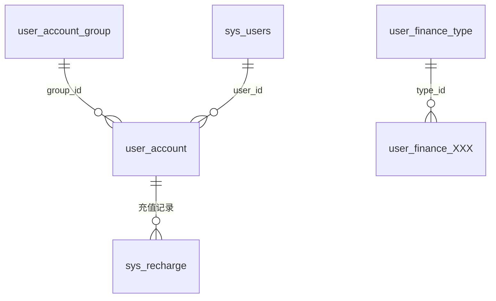
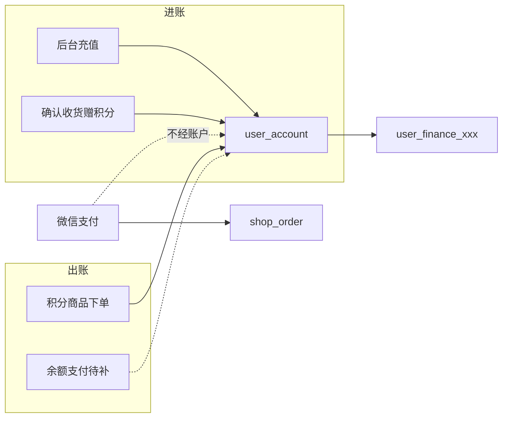

# 模块5：账户 · 余额 · 充值 · 流水

> 目标：搞清「币种账户」怎么建、怎么加减、和订单支付/积分的关系。  
> 前置：[04-user-auth.md](./04-user-auth.md)（注册时建账户）、[03a-order-pay.md](./03a-order-pay.md)（`payment` 枚举）。  
> 主源码：`service/common/account.go`（`AccountUnifyDeduction`）、`service/account/*`、`model/account/*`。

---

## 1. 范围与关系

本模块盯：

- 表：`user_account_group`、`user_account`、`sys_recharge`、`user_finance_type`、**按币种分表的流水** `user_finance_{name_en}`
- 核心能力：查询余额、后台充值/调账、写流水；积分扣减与发放也走同一套
- 与订单：`payment` 字段枚举含余额/积分；**现网零售主路径仍是微信**，积分单会扣积分账户



约定常量（`service/common/account.go`，**与库里币种 id 绑定，改库要同步改代码**）：

| 常量 | 值 | 含义 |
|------|-----|------|
| `CASH` | 1 | 余额币种 `group_id` |
| `POINT` | 2 | 积分币种 `group_id` |

---

## 2. 表与字段

### 2.1 `user_account_group` 币种/账户类型配置

| 字段 | 含义 |
|------|------|
| name_en | 英文名；**流水表名后缀**，如 `cash` → 表 `user_finance_cash` |
| name_cn | 中文名（余额不足提示会用） |
| places | 小数位数 |
| status | `0` 禁用 `1` 启用 |
| sync | 是否已同步给用户建账户等 |

新增币种后常需「同步」给已有用户建 `user_account`（管理端 `syncAccountGroup`）。

### 2.2 `user_account` 用户账户（一人 × 一币种一行）

| 字段 | 含义 |
|------|------|
| user_id | → `sys_users.id` |
| group_id | → `user_account_group.id` |
| amount | **可用余额** |
| freeze_amount | 冻结 |
| lock_amount | 锁仓 |
| in_amount / out_amount | 累计入账 / 出账 |
| status | 账户状态（`1` 正常） |

注册用户时：遍历所有 `AccountGroup`，为每人插对应行（初始金额多为 0）。

### 2.3 `sys_recharge` 后台充值/调账记录

| 字段 | 含义 |
|------|------|
| user_id / username | 被操作用户 |
| group_id | 币种 |
| admin_id / admin_name | 操作管理员 |
| amount | 增减数额（可正可负） |
| balance | 变动后数额（记录当时计算结果） |
| remarks | 备注 |

真正改余额走 `AccountUnifyDeduction`；本表是管理端留痕。

### 2.4 `user_finance_type` 流水类型字典

树形（`parent_id`）：如充值、消费、确认收货赠积分等。  
`AccountUnifyDeduction` / `NewFinance` 要求传 **`type_id`**（代码里写死数字处需与库数据一致，如充值常用 `8`、积分商品扣减 `1`、收货赠积分 `6`——以你库中字典为准）。

### 2.5 流水表 `user_finance_{name_en}`

**不是**一张固定表名；按币种英文名分表，例如：

- `user_finance_cash`
- `user_finance_point`

结构同一套 `UserFinance` 模型，写入时：

```go
subTx.Table("user_finance_" + group.NameEn).Create(&finance)
```

| 字段 | 含义 |
|------|------|
| user_id / username | 账户所属用户 |
| type_id | 流水类型 |
| option_type | `0` 动可用余额 `1` 冻结 `2` 锁仓 |
| amount | 变动额（**负数为扣**） |
| balance | 变动后对应桶的余额 |
| fee_amount / is_fee | 手续费 |
| from_id | 来源单号（如 `order_sn`） |
| from_user_id / from_name | 来源用户/操作者 |
| remarks | 备注 |

路由里的 `userFinanceCash` 主要面向现金类流水 CRUD；积分流水同模型不同表。

---

## 3. 接口地图（Private）

| 前缀 | 用途 |
|------|------|
| `/account/*` | 账户 CRUD；`findUserAccount` 查当前用户某币种 |
| `/userAccountGroup/*` | 币种配置；含 `syncAccountGroup` |
| `/sysRecharge/*` | 后台充值/调账 |
| `/userFinanceCash/*` | 流水查询/维护（现金表侧） |
| `/userFinanceType/*` | 流水类型字典 |

小程序侧一般只读余额；加减多由订单/收货/后台充值触发。

---

## 4. 关键流程

### 4.1 统一加减：`AccountUnifyDeduction`

```text
入参：groupId（1 余额 / 2 积分）、UserFinance（金额可正可负）
1. 校验用户存在且 enable=1；金额≠0；type_id 有效
2. 取 AccountGroup、用户该币种 Account
3. 按 option_type 改 amount / freeze / lock（扣减时校验够不够）
4. 更新 in_amount / out_amount
5. 事务：Save 账户 + Insert 对应 user_finance_{name_en}
```

`NewFinance(...)` 只是拼一条 `UserFinance` 的辅助函数。

注意：函数内部自己 `Begin/Commit`；若外层已有事务（如充值、下单），存在嵌套事务/回滚不彻底的风险，二次开发宜收紧为传入 `tx`。

### 4.2 用户注册建账户

```text
Register
  → 查全部 AccountGroup
  → 事务：Create 用户 + 为每个 group 插 user_account
```

见 [04-user-auth.md](./04-user-auth.md)。

### 4.3 后台充值 `CreateSysRecharge`

```text
按 username 找用户 → 确认该 group 账户存在
  → 写 sys_recharge（管理员信息、变动后 balance）
  → AccountUnifyDeduction(groupId, finance)  // type_id 常为 8
```

支持给余额或积分账户加减（看传入的 `groupId`）。注释写明：**暂未支持冻结/锁仓充值**。

### 4.4 和订单的关系（对照 `payment`）

订单 `payment` 枚举（见 03a）：

| 值 | 含义 | 与本模块 |
|----|------|----------|
| 1 | 余额 | **枚举有**；零售 `CreateOrder` **未走**「扣 CASH 账户当支付」主路径 |
| 2 | 微信 | 零售默认；钱在微信，不经 `user_account` |
| 4 | 积分 | 积分商品：建单扣 **POINT** 账户 |
| 5 | 线下 | 月结等场景 |

当前订单侧真实触达账户的路径主要是：

| 场景 | 调用 |
|------|------|
| 积分商品下单 | `AccountUnifyDeduction(POINT, 负数)` |
| 确认收货发积分 | `AccountUnifyDeduction(POINT, +gift_points)`（普通商品 `goods_area==0`） |
| 后台充值 | `CreateSysRecharge` → 统一扣减（金额为正即加） |

**余额支付（payment=1）**：字段预留了，完整「选余额下单 → 扣 CASH → status=1」需二次开发补齐；现在零售现结主要是微信。



---

## 5. 源码锚点

| 层级 | 路径 |
|------|------|
| 统一扣减 | `service/common/account.go` |
| 账户/币种/充值/流水 | `service/account/*.go`、`router/account/*.go` |
| 模型 | `model/account/*.go` |
| 注册建账户 | `service/system/sys_user.go` → `Register` |
| 积分扣减 | `service/shop/order.go`（`PointGoodsId > 0`） |
| 积分发放 | `service/shop/order_delivery.go` → `UpdateOrderDelivery` |
| 管理端 | `web/src/view` 下 account / recharge 相关页 |

建议精读：`AccountUnifyDeduction` 全文 → `CreateSysRecharge` → 对照积分下单与收货两段调用。

---

## 6. 二次开发提示

| 现状 | 建议 |
|------|------|
| `CASH`/`POINT` 写死 id | 配置化或启动校验与库一致 |
| 流水分表靠 `name_en` | 改英文名要迁表；命名规范写入交付文档 |
| 余额支付未闭环 | 要「储值商城」再补：下单扣 CASH + payment=1 + 失败回滚 |
| 统一扣减自开事务 | 与下单/充值外层事务整合，避免嵌套 |
| 加减无乐观锁/条件更新 | 高并发可对 `user_account` 条件更新或行锁（类似 FUL-05） |
| type_id 魔法数字 | 与 `user_finance_type` 种子数据绑定，文档化 |

通用 B2C：可保留积分作营销；储值余额按客户需求开关。

---

## 7. 本模块过关自测

1. 一个用户多个币种，在库里几行 `user_account`？谁在注册时创建？  
2. `AccountUnifyDeduction` 扣积分和加余额，靠什么区分？`amount` 正负含义？  
3. 流水写进哪张表？和 `name_en` 什么关系？  
4. 微信支付成功会不会改 `user_account`？  
5. 订单 `payment=1`（余额）现在有没有完整下单扣款实现？  
6. 后台充值改余额的调用链是什么？  

能答即可进入 **模块 6**（运营与系统权限，可粗看）。
