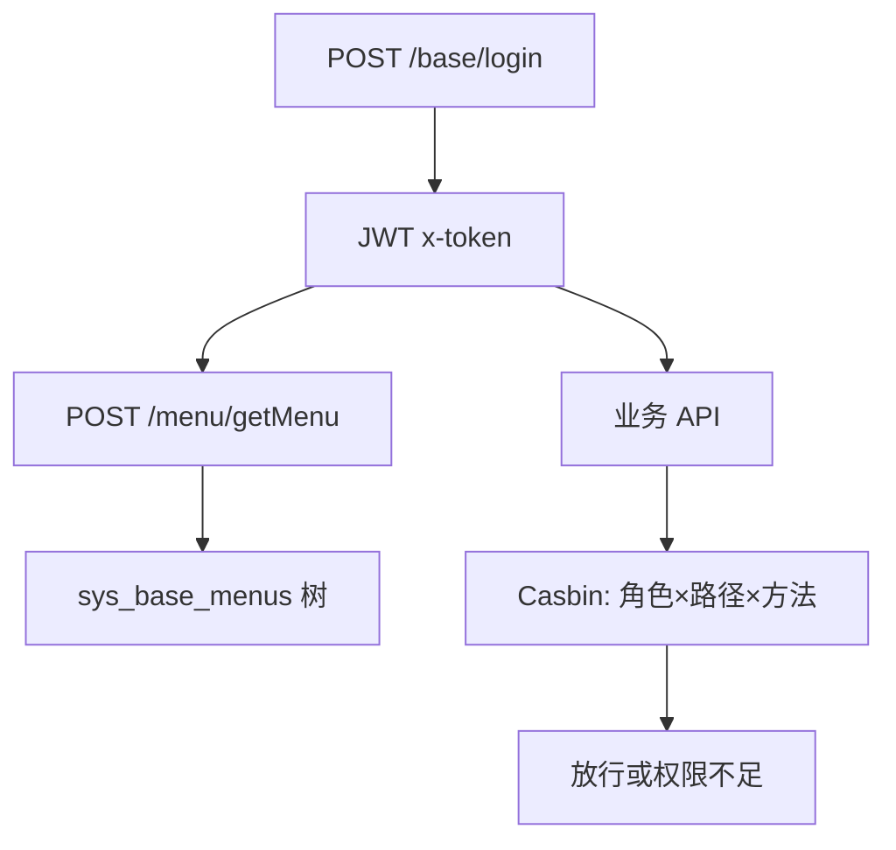

# 模块6：运营与系统（可粗看）

> 目标：知道管理端「菜单从哪来、接口谁能调」、以及 Banner/配送员/字典/配置放哪。  
> 不必背全量 Casbin 规则；**接单部署**时 JWT、角色菜单、`sys_config`、生产环境 Casbin 要会用。  
> 主源码：`middleware/jwt.go`、`middleware/casbin_rbac.go`、`router/system/*`、`router/business/*`。

---

## 1. 范围与关系

本模块分两块：

| 块 | 内容 |
|----|------|
| **运营** | Banner 轮播、配送员（衔接 [03b](./03b-order-fulfillment.md) 发货） |
| **系统** | 角色/菜单/Casbin、字典、`sys_config` |



Private 链路（复习模块0）：

```text
请求 → JWTAuth（认人）→ CasbinHandler（认权）→ 业务 Handler
```

例外：`config.yaml` 里 **`system.env == "develop"` 时 Casbin 整段放行**（本地方便，生产勿用）。

---

## 2. 运营：Banner

### 2.1 表 `shop_banner`

| 字段 | 含义 |
|------|------|
| img_url | 图片地址 |
| to_path | 跳转路径 |
| type | 跳转类型（注释：0 页面跳转） |
| sort | 排序 |

### 2.2 接口

| 鉴权 | 路径 | 用途 |
|------|------|------|
| Private | `POST/PUT/DELETE /banner/...` | 后台维护 |
| **Public** | `GET /banner/getBannerList`、`findBanner` | 小程序首页可匿名拉 |

源码：`router/business/banner.go`、`service/business/banner.go`。

---

## 3. 运营：配送员 `user_delivery`

### 3.1 表字段

| 字段 | 含义 |
|------|------|
| name / mobile | 姓名、手机 |
| deliver_count | 送货单数（确认收货且带了 delivery_id 时 +1） |
| status | `0` 禁用 `1` 启用 |

### 3.2 接口与发货

- 全部 **Private**：`/userDelivery/*`（CRUD + `getUserDeliveryAllList` 下拉）
- 发货选配送员 → `POST /orderDelivery/createOrderDelivery`（`delivery_id`）
- 细节见 [03b-order-fulfillment.md](./03b-order-fulfillment.md)

通用快递商城可改成运单号模型；城配客户可保留本表。

---

## 4. 系统：角色 · 菜单 · Casbin

### 4.1 关键表（注意真实表名）

| 表 | 作用 |
|----|------|
| `sys_users` | 用户；`authority_id` = 当前角色（C 端常 1000，管理端常 888 等） |
| `sys_authorities` | 角色（`authority_id`、名称、父角色、默认首页路由等） |
| `sys_user_authority` | 用户 ↔ 多角色 |
| **`sys_base_menus`** | 菜单定义（path、component、meta…）；**不是** `sys_menus` |
| `sys_authority_menus` | 角色 ↔ 菜单 |
| `casbin_rule` | API 策略：角色 + path + method |

另有：数据权限、按钮权限（`sys_authority_btn`）等，单商户可后看。

种子角色常见：**888** 管理员、**1000** 小程序普通用户等（以你库/种子为准）。

### 4.2 Casbin 怎么拦

```text
sub = JWT 里的 AuthorityId（字符串）
obj = 请求 path（去掉 router-prefix）
act = HTTP Method
Enforce(sub, obj, act) → false 则「权限不足」
```

匹配支持 `keyMatch2`（路径模式）。  
策略在管理端「API 权限」维护：`/casbin/updateCasbin`、`getPolicyPathByAuthorityId`。

**踩坑**：新加业务路由后，生产环境必须给角色补 Casbin 规则，否则登录能进、点菜单接口 403。种子未必覆盖全部 shop/business API。

### 4.3 管理端动态菜单

```text
1. POST /base/login（Public）→ token + 用户（含 authorityId）
2. 前端带 x-token：POST /menu/getMenu
3. 后端按当前角色：
   · sys_authority_menus → menuIds
   · 查 sys_base_menus 组树（+ 按钮权限）
4. 前端按 path/component 生成侧边栏与动态路由
```

菜单管理本身：`/menu/getMenuList`、`addMenuAuthority` 等（Private）。

源码：`api/v1/system/sys_menu.go`、`service/system/sys_menu.go`（`GetMenuTree`）、`middleware/casbin_rbac.go`。

---

## 5. 字典

| 表 | 要点 |
|----|------|
| `sys_dictionaries` | `name`、`type`（英文 key）、`status` |
| `sys_dictionary_details` | `label`、`value`、`sort`、归属字典 id |

用途：管理端下拉（订单状态、退款状态等）。接口前缀 `/sysDictionary`、`/sysDictionaryDetail`（Private）。

种子里常有代码生成用类型；**业务枚举要自己加**。前端 `getDictFunc('OrderStatusRefund')` 这类即读字典。

---

## 6. 配置 `sys_config`

| 字段 | 含义 |
|------|------|
| name | 配置 key |
| value | 值 |
| group_type | 分组 |
| desc | 说明 |
| status | `1` 开 / `0` 关（关则按名取可能报错） |

| 鉴权 | 路径 | 用途 |
|------|------|------|
| Private | `/sysConfig` CRUD | 后台改配置 |
| **Public** | `/sysConfig/findSysConfigByName` | 按 key 读（如积分开关等） |

业务代码常用 `service/common/config.go` → `GetSysConfig(name)`。  
部署时：支付相关仍多在 `config.yaml`；运营开关、积分比例等可能在本表——以实际调用为准。

---

## 7. 源码锚点速查

| 主题 | 路径 |
|------|------|
| JWT / Casbin 中间件 | `middleware/jwt.go`、`casbin_rbac.go` |
| 路由总装 | `initialize/router.go` |
| 角色/菜单/Casbin/字典/配置 | `router/system/`、`service/system/`、`model/system/` |
| Banner / 配送员 | `router/business/`、`model/business/` |
| 种子数据 | `source/system/`（authority、menu、casbin、dictionary） |

建议精读顺序：`CasbinHandler` → `getMenu`/`GetMenuTree` → 扫一眼 Banner Public 与 `sys_config` Public。

---

## 8. 二次开发 / 部署清单

| 优先级 | 项 |
|--------|-----|
| **必做** | 生产 `env` ≠ `develop`；管理员角色 + 菜单 + Casbin 覆盖你开放的 API |
| **必做** | 每客户独立 `jwt.signing-key`、微信/支付配置（yaml）；核对 `sys_config` 业务 key |
| **常用** | Banner、配送员（或改成快递字段） |
| **按需** | 字典补业务枚举；按钮级权限、数据权限 |
| **粗看即可** | 自动代码、操作日志、Casbin 全表种子 |

阶段一学到这里：**主链路表/接口/流程地图齐了**。缺口与增强见 [todo-gaps.md](./todo-gaps.md)、[payment-reliability.md](./payment-reliability.md)。  
下一步：阶段二在 `new_shop` 落通用脚手架（复制同栈、去品牌、配置隔离）——见路线图。

---

## 9. 本模块过关自测

1. Private 请求经过哪两个中间件？develop 环境 Casbin 有何特殊？  
2. 动态菜单打哪个接口？数据来自哪几张表？  
3. Casbin 的 sub/obj/act 分别是什么？  
4. Banner 列表为什么小程序不用登录也能拉？  
5. `sys_config` 与 `config.yaml` 大概如何分工？  
6. 新加一个管理端 API 后生产 403，优先查什么？  

能答即可结束阶段一模块学习，进入阶段二或回头补 todo。
