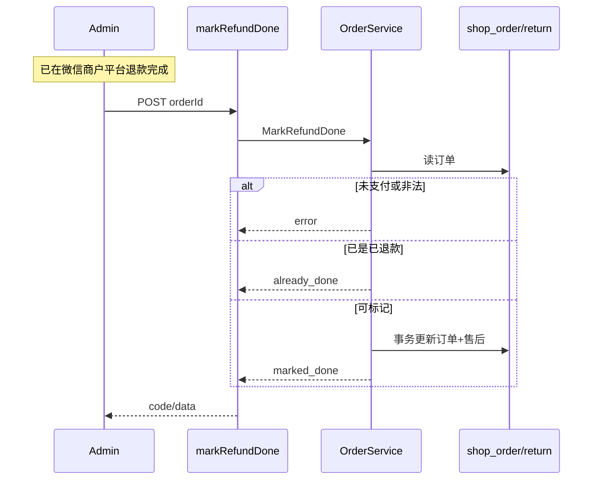

# fulfillment — server 设计报告（M2-1 / FUL-06 人工标记退款完成）

> **评审状态**：已通过并实现（2026-08-12）。  
> 切片：阶段二 **M2-1**。总序见 [phase2-module-roadmap.md](../../../phase2-module-roadmap.md)。  
> 对照：[todo-gaps.md](../../../todo-gaps.md) FUL-06、[03b-order-fulfillment.md](../../../03b-order-fulfillment.md)。  
> 与支付关系：本版**不调微信退款 API**（PAY-05 / M2-4 另议）；只做「商户平台人工退款后的系统状态闭环」。

## 1. 目标

- 提供管理端专用接口：**标记退款完成**（非整单 `Save`）
- 将订单 `status_refund` 安全推进到 **已退款(2)**；若有售后单，同步其退款/售后状态与处理时间
- 状态机校验：拒绝未支付、已完成退款的非法跃迁；已退款幂等成功
- 操作走现有 `OperationRecord`，便于审计「谁点了完成」
- **本版默认不回库存、不调微信**（见「暂不实现」）

## 2. 现状分析

- 字段已有：`shop_order.status_refund`（0 未退 / 1 退款中 / 2 已退 / 3 失败）；`shop_order_return` 有 `status` / `refund_status` / `process_time`
- 列表、统计、月结、管理端发货按钮多处依赖 `status_refund=0` 才当「正常单」
- **缺口**：无「标记退款完成」专用动作；运营只能 `PUT /order/updateOrder` / `updateOrderReturn` 改字段——易误改、不联动双表、无状态校验
- `CancelOrder` 注释写已支付需退款，**未改** `status_refund`、不回库存
- 售后 CRUD 为脚手架，不联动订单 `status_refund`
- 产品约定：标准交付可接受「微信商户平台人工退款 + 系统标记完成」

## 3. 数据模型与接口

### 数据模型

**无新表、无新字段。** 复用：

| 表/字段 | 本版写入 |
|---------|----------|
| `shop_order.status_refund` | → `2`（已退款） |
| `shop_order_return.refund_status` | 若存在售后行 → `2`（退款成功） |
| `shop_order_return.status` | 若存在且非拒绝(-1) → 置「已退款」语义值（见下） |
| `shop_order_return.process_time` | 标记完成时刻 |

**售后 `status` 取值注意**：模型注释为 `-1/0/1`，字典 `returnStatus` 存在「已退款=2」的说法；实现 tasks 时以**库内现网字典与样例数据**为准，在代码常量中写死本版采用值并单测覆盖。设计约定：**本版将「售后已完成/已退款」写为与现网后台展示一致的完成态**（优先对齐字典已退款值）。

| 决策 | 理由 |
|------|------|
| 不新建退款流水表 | 与支付侧「无流水」策略一致；人工退以商户平台为准 |
| 条件更新 / 事务 | 防并发双点；订单与售后同事务 |
| 不回库存（本版） | 部分退/整单退规则未产品化；先闭环状态，回库存另切片 |

### 状态跃迁（订单）

| 当前 `status_refund` | 行为 |
|----------------------|------|
| `1`（退款中） | 允许 → `2` |
| `0`（未退款） | **允许** → `2`（兼容：无正式「退款中」流转、但已在商户平台退完的运营场景）；须已支付 |
| `2`（已退款） | 幂等成功，不改写 |
| `3`（失败） | 允许 → `2`（人工处理后收尾） |

其它门闩：

| 条件 | 结果 |
|------|------|
| 订单不存在 | 错误 |
| `status == 0`（未支付） | 拒绝 |
| 仅取消未支付场景 | 不适用本接口（走取消，不标记退款） |

不强制「必须先有 OrderReturn」：无售后单时也可只改订单 `status_refund`（方便已支付取消后人工退款的运营路径）。

### 接口契约

| 鉴权 | 方法/路径 | 用途 |
|------|-----------|------|
| Private + OperationRecord | `POST /order/markRefundDone` | 标记退款完成 |

请求：

```json
{
  "orderId": 123
}
```

响应成功：

```json
{
  "code": 0,
  "data": {
    "orderId": 123,
    "statusRefund": 2,
    "action": "marked_done" | "already_done",
    "returnSynced": true
  },
  "msg": "标记成功"
}
```

| action | 含义 |
|--------|------|
| `marked_done` | 本次写入已退款 |
| `already_done` | 原本已是已退款（幂等） |

错误 msg 示例：订单不存在、订单未支付不可退款标记、状态不允许。

内部服务（示意）：

```text
MarkRefundDone(orderId):
  事务:
    锁/读订单
    校验门闩
    if status_refund==2 → already_done
    UPDATE shop_order SET status_refund=2 WHERE id=? AND status_refund IN (0,1,3)
    若 RowsAffected==0 且已是 2 → already_done；否则失败
    若存在 order_return(order_id)：更新 refund_status/status/process_time
  返回结果
```

## 4. 核心流程



边界：

| 场景 | 行为 |
|------|------|
| 双击按钮 | 第二次幂等 `already_done` |
| 有售后单 | 同步售后退款成功 + 处理时间 |
| 无售后单 | 只改订单 |
| 与发货并发 | 本版不改 `status`/`status_cancel`；发货前端本就看 `statusRefund===0`，标记后自然隐藏发货 |

## 5. 项目结构与技术决策

```text
server/
  api/v1/shop/order.go           # MarkRefundDone handler
  router/shop/order.go           # POST markRefundDone（带 OperationRecord）
  service/shop/order.go          # 或 order_refund.go：MarkRefundDone
  model/shop/order.go            # 可选：StatusRefund* 常量
```

```text
管理端 Web → POST /order/markRefundDone → OrderApi → OrderService → DB
禁止：业务里再调通用 UpdateOrder 完成同一语义
```

| 决策 | 方案 | 理由 |
|------|------|------|
| 挂 order 路由 | 与 cancelOrder / syncWechatPay 一致 | 运营从订单操作 |
| 条件更新 | `WHERE status_refund IN (0,1,3)` | 轻量并发安全 |
| 不回库存 | 暂不实现 | 规则未清；避免错加库存 |
| 不调微信 | 红线 | 属 PAY-05 |

| 依赖 | 用途 | 已有/需新增 |
|------|------|-------------|
| Gin Private + Casbin | 鉴权 | 已有（与 updateOrder 同权限组即可） |
| OperationRecord | 审计 | 已有中间件 |
| 微信退款 SDK | — | **本版不用** |

## 6. 暂不实现

| 功能 | 理由 |
|------|------|
| 微信退款 API / 回调 | PAY-05 / M2-4 |
| 回库存 | 整单/部分退未约定；Cancel 现状亦不回；另开切片 |
| 强制「先 status_refund=1」才能标记 | 放宽兼容人工流程；若产品要坚持可评审收紧 |
| 退款金额二次校验、退款流水表 | 人工以商户平台为准 |
| 小程序侧标记 | 仅管理端 |
| 发货/取消乐观锁 | M2-2 |
| 统一修复 returnStatus 字典与模型注释不一致 | 本版只约定完成态写入值，全量治理另议 |

---

## 过关标准

1. 已支付且 `status_refund∈{0,1,3}`：调用后订单为 `2`；有售后则同步完成态  
2. 再次调用：幂等成功，不报错  
3. 未支付订单：拒绝  
4. 通用 `updateOrder` 仍存在，但管理端主路径引导用专用按钮（web 设计）  

**下一步**：已完成，见 [tasks.md](./tasks.md)。
