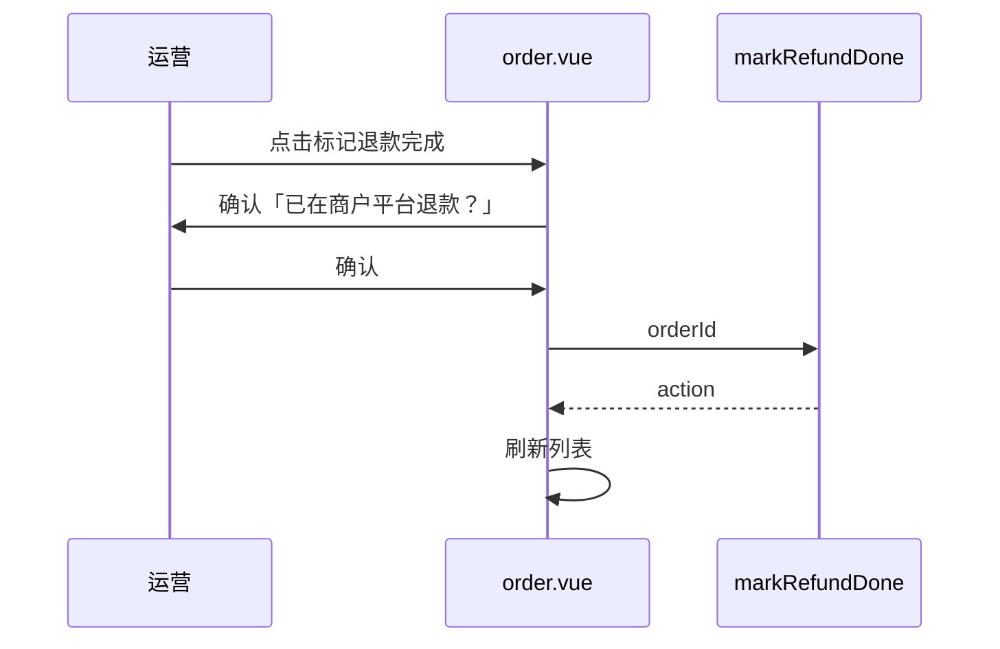

# fulfillment — web 设计报告（M2-1 标记退款完成）

> **评审状态**：已通过并实现（2026-08-12）。依赖同版本 [server/design.md](../server/design.md)。  
> 管理端仅增加操作入口，不改列表筛选项语义。

## 1. 目标

- 订单列表（及可选售后页）增加 **「标记退款完成」** 按钮
- 调用 `POST /order/markRefundDone`，成功后刷新行数据
- 文案提示：须已在微信商户平台完成退款

## 2. 现状分析

- `order.vue` / `orderMonth.vue`：有退款状态展示与通用「变更」弹窗，**无**专用退款完成动作
- `orderReturn.vue`：通用 CRUD 可改 `refundStatus`，不联动订单

## 3. 数据模型与接口

### 前端状态

| 项 | 说明 |
|----|------|
| 显示条件 | 建议：`status > 0` 且 `statusRefund !== 2`（已退隐藏）；优先在 `statusRefund === 1` 或存在售后时高亮 |
| 交互 | 二次确认 Dialog → 调 API → ElMessage → 刷新列表 |

### 接口

复用 server：`POST /order/markRefundDone`，body `{ orderId }`。

封装：`web/src/api/order.js` 增加 `markRefundDone`。

## 4. 核心流程



## 5. 项目结构与技术决策

```text
web/src/api/order.js
web/src/view/shop/order/order.vue          # 主入口
web/src/view/shop/order/orderMonth.vue     # 同构补按钮（可选同版）
web/src/view/shop/orderReturn/orderReturn.vue  # 可选：有 orderId 时同样调用
```

| 决策 | 方案 | 理由 |
|------|------|------|
| 主放订单页 | 运营习惯从订单处理 | 与 cancel/发货同列 |
| 二次确认 | 降低误点 | 钱已在站外退，误标仍麻烦 |
| 不在本版改通用变更弹窗 | 专用按钮引导正确路径 | 减少误改 |

## 6. 暂不实现

| 功能 | 理由 |
|------|------|
| 发起微信退款按钮 | PAY-05 |
| 回库存勾选 | server 本版不做 |
| 小程序 UI | 仅管理端 |

---

## 过关标准

1. 符合条件的订单可见按钮；点确认后 `statusRefund` 变为已退款  
2. 已退款订单不再显示该按钮（或点了提示已完成）  

**下一步**：已完成，见 [tasks.md](./tasks.md)。
