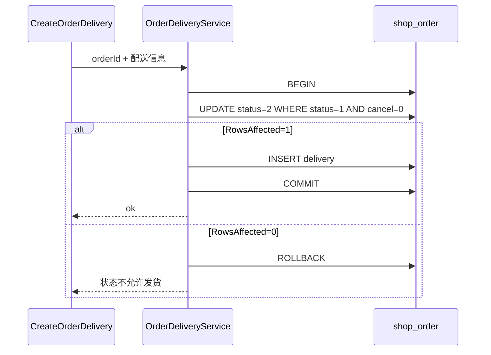
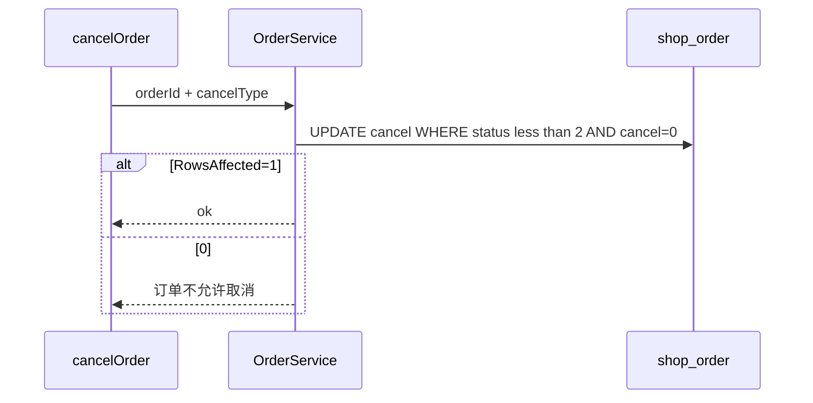

# fulfillment — server 设计报告（M2-2 / FUL-05 发货·取消竞态）

> **评审状态**：已通过并实现（2026-08-12）。  
> 切片：阶段二 **M2-2**。前置：[v0.1.0](../v0.1.0/server/design.md) 标记退款。  
> 对照：[todo-gaps.md](../../../todo-gaps.md) FUL-05、[03b-order-fulfillment.md](../../../03b-order-fulfillment.md)。  
> 模式对齐：支付入账 [pay_mark.go](../../../../server/service/wechat/pay_mark.go) 的条件更新 + `RowsAffected`。

## 1. 目标

- 消除「发货与取消并发」导致的脏写：已取消被冲成未取消、或已发货仍被取消成功
- **发货**：仅当 `status=1 AND status_cancel=0` 时写入 `status=2` 与发货时间；禁止 `Save` 整单覆盖 `status_cancel`
- **取消**：仅当 `status<2 AND status_cancel=0` 时写入取消态；`RowsAffected==0` 则明确失败
- **本版不新增 `version` 列**（零迁移）；与支付侧条件更新策略一致
- HTTP 路径与入参不变，仅改服务层原子性

## 2. 现状分析

### 竞态（FUL-05）

```text
发货 First(status=1,cancel=0) 通过
  → 用户 Cancel 写 status_cancel=1
  → 发货 Save 整单（内存里 cancel 仍为 0）→ status=2 且把 cancel 冲回 0
→ 已发货且取消标记被抹掉
```

对称风险：Cancel 读到 `status=1` 后、发货已写成 `2`，Cancel 仍可能 `Updates` 成功，出现「已发货却已取消」。

### 代码现状

| 动作 | 文件 | 问题 |
|------|------|------|
| 发货 | `service/shop/order_delivery.go` → `CreateOrderDelivery` | 事务外 First + 事务内 `Save(&order)` 整行 |
| 取消 | `service/shop/order.go` → `CancelOrder` | First 后 `Updates` 仅 `WHERE id=?`，无状态条件 |
| 确认收货 | `UpdateOrderDelivery` | 同类 TOCTOU；**本版不改**（留给对齐小程序的 M2-3 或紧随切片） |

- `shop_order` **无** `version` 字段；`DbModel` 仅 ID/时间戳/软删
- 支付侧已证明：`UPDATE ... WHERE status=0` + `RowsAffected` 足够防并发双入账

## 3. 数据模型与接口

### 数据模型

**无新表、无新列。** 继续使用：

| 字段 | 本版约束 |
|------|----------|
| `status` | 发货：`1→2`；取消：必须 `<2` |
| `status_cancel` | 发货要求 `=0`；取消：`0→1/2/3` |
| `shipment_time` / `cancel_time` | 随对应动作写入 |

| 决策 | 理由 |
|------|------|
| 条件更新，不加 version | 零迁移、与 pay_mark 一致、改动面小 |
| 发货只更新必要列 | 避免 `Save` 覆盖并发写入的 `status_cancel` 等 |
| 确认收货本版不动 | 边界收窄；过关标准聚焦发货↔取消 |

### 接口契约

**对外 HTTP 不变：**

| 方法 | 路径 | 说明 |
|------|------|------|
| 现有 | 创建发货（如 `POST /orderDelivery/createOrderDelivery`） | 失败 msg 更明确（状态不允许） |
| 现有 | `POST /order/cancelOrder` | 同上 |

无新路由。错误示例：

- 发货：`订单状态不允许发货`（已取消 / 非待发货 / 并发被抢）
- 取消：`订单不允许取消`（已发货或已取消）

内部更新契约（示意）：

```text
ShipOrder(orderId):  // CreateOrderDelivery 内
  事务:
    UPDATE shop_order
      SET status=2, shipment_time=?
      WHERE id=? AND status=1 AND status_cancel=0
    IF RowsAffected==0 → 失败（可再读区分原因）
    INSERT shop_order_delivery ...

CancelOrder(orderId, cancelType):
  UPDATE shop_order
    SET status_cancel=?, cancel_time=?
    WHERE id=? AND status < 2 AND status_cancel=0
  IF RowsAffected==0 → 失败
```

## 4. 核心流程

### 4.1 发货（条件更新）



### 4.2 取消（条件更新）



### 4.3 并发边界

| 场景 | 期望 |
|------|------|
| 先取消成功，再发货 | 发货 `RowsAffected=0`，失败；订单保持已取消、未发货 |
| 先发货成功，再取消 | 取消 `RowsAffected=0`，失败；订单保持已发货、未取消 |
| 双发货 | 仅一单 delivery 成功（第二笔条件更新失败） |
| 已支付未发货取消 | 与现网一致：可取消；本版仍**不回库存、不改 status_refund**（既有缺口） |

可选增强（本版可不做）：事务内 `SELECT ... FOR UPDATE` 再更新；条件更新已足够。

## 5. 项目结构与技术决策

```text
server/
  service/shop/order_delivery.go   # CreateOrderDelivery 改条件更新
  service/shop/order.go            # CancelOrder 改条件更新
  service/shop/order_ship_cancel_test.go  # 可选：常量/条件字符串单测；或集成测说明
```

无新 API 层文件；router 不变。

| 决策 | 方案 | 理由 |
|------|------|------|
| 条件更新 vs version | **条件更新** | 零 schema；对齐 pay_mark；FUL-05 文档方案 2 |
| 发货事务范围 | 条件更新订单 + 创建 delivery 同事务 | 避免「订单已发货但无 delivery 行」 |
| First 预检 | 可保留作友好错误，**写库必须以 WHERE 为准** | 预检不能代替原子条件 |
| 支付入账 | 不改 | 已条件更新（PAY-03） |

| 依赖 | 用途 | 已有/需新增 |
|------|------|-------------|
| GORM Updates/Create | 条件写 | 已有 |
| 表迁移 | — | **本版无** |

## 6. 暂不实现

| 功能 | 理由 |
|------|------|
| `shop_order.version` 乐观锁列 | 非必须；加大迁移与全路径改造 |
| `UpdateOrderDelivery` 确认收货条件更新 | 可紧随或并入 M2-3；本版聚焦发货↔取消 |
| 取消回库存 / 已支付取消自动退款 | PAY-06 / 既有缺口，非本切片 |
| 小程序确认收货路由对齐 | M2-3 |
| 微信自动退款 | M2-4 / PAY-05 |
| 改管理端/uniapp UI | 无新交互；仅错误文案可能更清晰 |

---

## 过关标准

1. 模拟「发货校验通过后、Save 前取消成功」：发货必须失败，订单保持 `status_cancel≠0` 且 `status≠2`（或等价：不会出现已发货+未取消的冲掉结果）  
2. 已发货订单取消：必须失败  
3. 正常路径：待发货未取消 → 发货成功；待发货未取消 → 取消成功  
4. 无 DB schema 变更即可上线  

**下一步**：已完成，见 [tasks.md](./tasks.md)。
