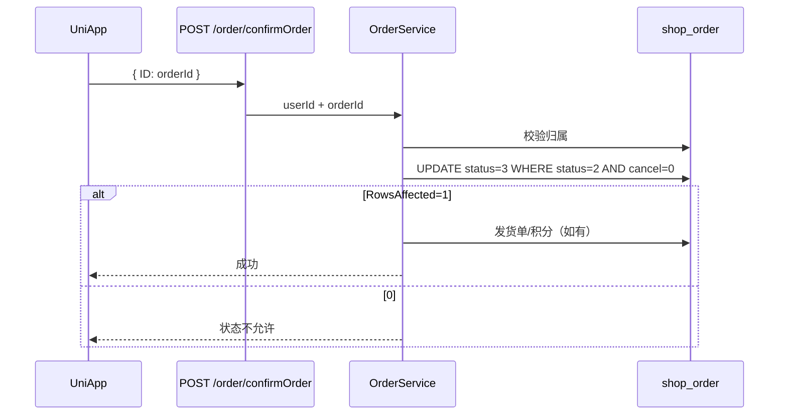

# fulfillment — server 设计报告（M2-3 / FUL-02 确认收货对齐）

> **评审状态**：已通过并实现（2026-08-12）。  
> 切片：阶段二 **M2-3**。前置：[v0.2.0](../v0.2.0/server/design.md) 发货/取消条件更新。  
> 对照：[todo-gaps.md](../../../todo-gaps.md) FUL-02、[03b-order-fulfillment.md](../../../03b-order-fulfillment.md) §3.4。  
> 小程序侧见同版本 [uniapp/design.md](../uniapp/design.md)。  
> C 端入参用订单主键 `ID`（非 `order_sn`）的迁移风险见 [order-id-vs-sn.md](../../../order-id-vs-sn.md)；本切片不切换标识。

## 1. 目标

- 补齐 C 端 **`POST /order/confirmOrder`**：入参与现网小程序一致（`{ "ID": 订单id }`），真正把订单从已发货写成已收货
- 校验：登录用户必须是下单人；`status=2 AND status_cancel=0`；条件更新，避免与取消/重复确认竞态
- 收货时间由**服务端写入 now**，不要求前端传 `receiptTime` 或完整发货单
- 复用现有确认收货副作用：普通商品发积分、有配送员则 `deliver_count+1`、回写 `shop_order_delivery.receipt_time`（有发货单时）
- 管理端仍走 `PUT /orderDelivery/updateOrderDelivery`；本版顺手把该路径的订单写入改为条件更新（与 M2-2 同一套路），**不改 web UI**

## 2. 现状分析

- 真实收货逻辑在 `UpdateOrderDelivery`：查 `status=2 AND status_cancel=0`，有 `receiptTime` 才把 `status→3`；事务内 `Save` 整单（与发货同类 TOCTOU，M2-2 未改）
- 管理端会先 `findOrderDelivery` 再 PUT 整份发货单 + `receiptTime`，所以后台能收货
- 小程序 `confirmOrder` 打 **`POST /order/confirmOrder`**，body 只有订单 `ID`；**后端无此路由** → 确认收货实际失败
- 若让小程序直接调 `updateOrderDelivery`：缺 `orderId`/`receiptTime`/发货单主键，`Save` 整结构体会写坏数据；不适合 C 端
- Casbin：C 端角色 `1000` 已有 `/order/cancelOrder`，无 `confirmOrder`

## 3. 数据模型与接口

### 数据模型

**无新表。** 写入字段：

| 表/字段 | 本版 |
|---------|------|
| `shop_order.status` | `2→3`（条件更新） |
| `shop_order.receive_time` | 服务端 now（C 端）或请求 `receiptTime`（管理端，保持现网） |
| `shop_order_delivery.receipt_time` | 同步收货时间（有发货行时） |
| `user_delivery.deliver_count` | 发货单带 `delivery_id` 时 +1（与现网一致） |
| 积分账户 | `goods_area==0` 且 `gift_points>0` 时发放（与现网一致） |

| 决策 | 理由 |
|------|------|
| 新增 C 端专用接口，而不是改小程序去拼发货单 | 对齐现有 `{ ID }` 契约；避免 C 端误 Save 整单 |
| 条件更新 `status=2 AND status_cancel=0` | 与 M2-2 一致；防已取消仍收货、重复确认 |
| C 端校验 `user_id == JWT` | 不能确认别人的单 |
| 无发货单仍允许确认 | 以订单 `status=2` 为准；只跳过 delivery 行更新 |
| 已退款（`status_refund=2`）拒绝 | 避免退完款再完结履约；`0/1/3` 本版不额外拦截（与现网发货按钮策略接近） |

### 接口契约

| 鉴权 | 方法/路径 | 用途 |
|------|-----------|------|
| Private + JWT + Casbin | **`POST /order/confirmOrder`（新增）** | C 端确认收货 |
| Private（现有） | `PUT /orderDelivery/updateOrderDelivery` | 管理端确认收货；本版改条件更新，路径不变 |

**POST /order/confirmOrder**

请求：

```json
{ "ID": 123 }
```

`ID` = `shop_order.id`（与现网小程序一致，不是发货单 id）。

成功：

```json
{ "code": 0, "msg": "确认收货成功" }
```

错误 msg：订单不存在、无权操作、订单状态不允许确认收货（未发货/已取消/已收货/已退款）。

内部（示意）：

```text
ConfirmOrder(userId, orderId):
  读订单；不存在 / user_id≠userId → 错
  事务:
    UPDATE shop_order SET status=3, receive_time=now
      WHERE id=? AND status=2 AND status_cancel=0
    RowsAffected==0 → 失败
    若有 delivery：写 receipt_time；delivery_id>0 则 deliver_count+1
    goods_area==0：发积分（失败则回滚事务）
```

管理端 `UpdateOrderDelivery`：订单写入改为同样 `WHERE status=2 AND status_cancel=0`；仍要求带 `receiptTime` 才完结（保持后台现行为）。

## 4. 核心流程



边界：

| 场景 | 行为 |
|------|------|
| 重复点确认 | 第二次 `RowsAffected=0`，失败（已是 status=3） |
| 确认前被取消 | 失败；保持已取消 |
| 未发货（status=1） | 失败 |
| 管理端与 C 端同时确认 | 条件更新只有一次成功；积分只发一次（同事务） |

## 5. 项目结构与技术决策

```text
server/
  api/v1/shop/order.go                 # ConfirmOrder handler
  router/shop/order.go                 # POST confirmOrder
  service/shop/order.go 或 order_receive.go  # ConfirmOrder
  service/shop/order_delivery.go       # UpdateOrderDelivery 条件更新
  sql/migrations/…confirm_order.sql    # sys_apis + casbin（对齐 cancelOrder 角色）
```

```text
UniApp confirmOrder → POST /order/confirmOrder → OrderApi → Service → DB
管理端 → PUT updateOrderDelivery（路径不变）
禁止：C 端直接 Save 发货单整行
```

| 决策 | 方案 | 理由 |
|------|------|------|
| 补路由而非只改前端 URL | C 端契约简单 | 文档 FUL-02 写「对齐到 updateOrderDelivery」指**语义**，实现用专用接口更安全 |
| Casbin 跟 cancelOrder 同角色 | 1000/1001/888/999 | C 端才能调 |

## 6. 暂不实现

| 功能 | 理由 |
|------|------|
| 微信自动退款 / 回库存 | M2-4 / PAY-05 |
| 改管理端确认收货 UI | 已可用 |
| 物流单号 / courier_mode | M4 |
| 强制必须有发货单才能确认 | 兼容历史脏数据 |
| 确认收货后自动评价 | 无此需求 |

---

## 过关标准

1. 小程序已发货订单点确认收货：`status=3`，有 `receive_time`  
2. 非本人订单、未发货、已取消：拒绝  
3. 连点两次：第二次失败，积分不双发  
4. 管理端原确认收货路径仍可用  

**下一步**：部署后执行 `sql/migrations/20260812_fulfillment_m2_3_confirm_order.sql`；链路测试见 [link_test](../../../link_test/fulfillment/v0.3.0/link_test.md)。
