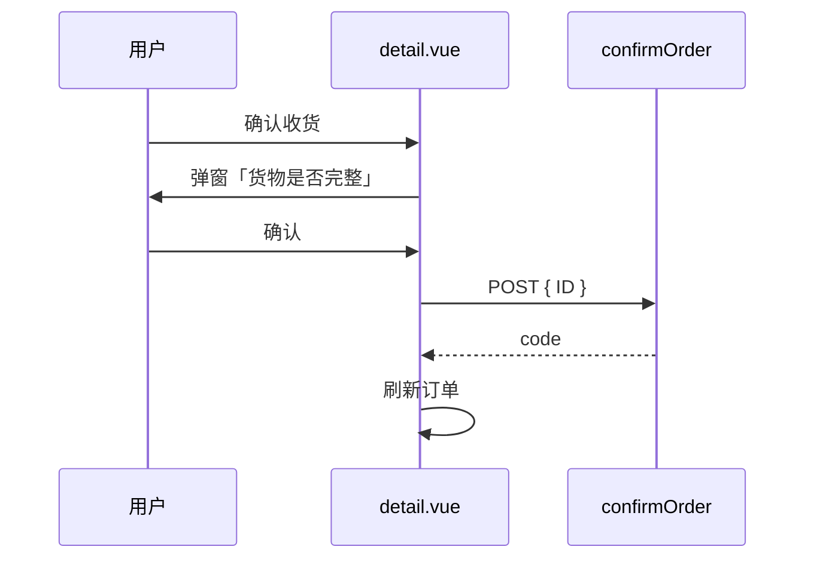

# fulfillment — uniapp 设计报告（M2-3 确认收货）

> **评审状态**：已通过并实现（2026-08-12）。依赖同版本 [server/design.md](../server/design.md)。  
> 小程序继续用 `confirmOrder({ ID })`，后端补齐同名路由后即可通。

## 1. 目标

- 确认收货请求打到真实存在的 **`POST /order/confirmOrder`**（函数名与入参保持 `{ ID: 订单id }`）
- 详情页按钮：已发货且未取消才展示（补 `statusCancel===0`）
- 列表组件若恢复「确认收货」按钮，走同一 API（本版不强制解开已注释按钮）
- 成功后刷新详情/列表，展示已完成

## 2. 现状分析

- `uniapp/api/order.js` → `POST /order/confirmOrder`，后端无路由
- `pages/order/detail.vue`：`status===2` 显示确认收货，未判断取消
- `components/orderList/orderList.vue`：列表按钮已注释，方法仍在
- `pages/order/list.vue`：import 了 `confirmOrder`，实际交互在子组件

## 3. 数据模型与接口

| 项 | 说明 |
|----|------|
| 请求 | `{ ID: orderId }`，JWT 已有 |
| 成功 | `code===0` → toast + 重新拉订单 |
| 失败 | 展示后端 `msg`（无权/状态不允许等） |

不在前端拼 `orderDelivery` / `receiptTime`。

显示条件建议：`status===2 && statusCancel===0`（已退款单详情本就有售后入口，可不另藏，以后端拒绝为准）。

## 4. 核心流程



## 5. 项目结构与技术决策

```text
uniapp/api/order.js              # URL 保持 /order/confirmOrder（server 补齐）
uniapp/pages/order/detail.vue    # 按钮条件 + 现有 toConfirmOrder
uniapp/components/orderList/orderList.vue  # 方法已对齐 ID，可不改 URL
```

| 决策 | 方案 | 理由 |
|------|------|------|
| 不改成 PUT updateOrderDelivery | 入参不匹配 | 见 server 设计 |
| 弹窗文案保持 | 「请您确认货物是否完整」 | 无产品变更 |

## 6. 暂不实现

| 功能 | 理由 |
|------|------|
| 解开列表注释按钮 | 非必须；详情已有入口 |
| 售后申请按钮（现注释） | 非本切片 |
| 管理端 web | 已有确认收货 |

---

## 过关标准

1. 详情页确认收货成功后状态变为已完成  
2. 已取消订单不展示或点了被后端拒绝  

**下一步**：后端补齐路由并执行 Casbin SQL 后，小程序详情页即可确认收货。
