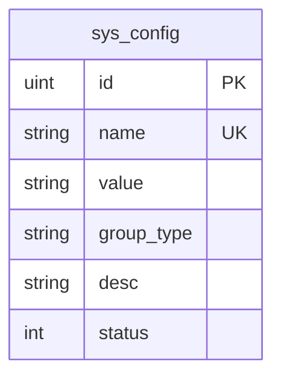
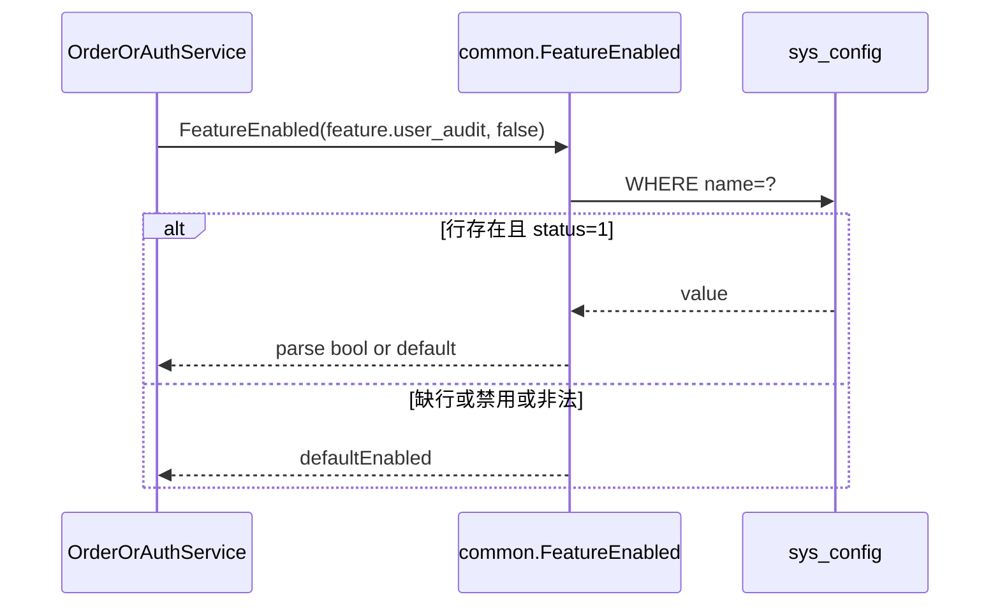

# industry-config — server 设计报告

> **评审状态**：已通过并实现（M0-1）。`tasks.md` 已执行完毕。  
> 切片：阶段二 **M0-1**（配置键约定 + 读取封装）。总序见 [phase2-module-roadmap.md](../../../phase2-module-roadmap.md)。

## 1. 目标

- 约定一组 **行业/功能开关** 的 `sys_config` 键名、取值与默认语义（默认偏标准 B2C）
- 将 `sys_config.name` 列宽扩展到可容纳带点号的 feature 键（现状 `size:20` 不够）
- 提供 Server 侧 **统一读取封装**（布尔 / 字符串），缺键或禁用时返回**安全默认值**，不因缺配置导致接口 500
- 用种子 SQL（或文档化 INSERT）写入初始三行配置，便于演示站与新客户库

## 2. 现状分析

- 已有表 `sys_config`（`name` / `value` / `group_type` / `desc` / `status`），CRUD 与 Public `findSysConfigByName` 可用；见 [06-ops-system.md](../../../06-ops-system.md)
- 业务侧已有 [`service/common/config.go`](../../../../server/service/common/config.go) 的 `GetSysConfig(name)`：缺行或 `status=0` 直接返回 error；调用方需自行处理（如订单积分读 `point`）
- **问题**：无统一「功能开关」键约定；`name` gorm `size:20` 无法放下可读键如 `feature.user_audit`；尚无「缺键 → 默认 B2C」策略
- 对照缺口：GEN-03（审核可关）依赖本切片先落地键与读取 API；本切片**不**改登录/下单逻辑

## 3. 数据模型与接口

### 数据模型

沿用 `sys_config`，本版本仅：

| 变更 | 说明 |
|------|------|
| `name` 列 | `varchar(20)` → `varchar(64)`（model 同步）；理由：feature 键可读、可带前缀 |
| 种子行 | 插入下表三键；`group_type = feature`；`status = 1` |

**约定键（本版本写入）**

| name | value 约定 | 默认 value | 语义（给后续切片用） |
|------|------------|------------|----------------------|
| `feature.user_audit` | `0` / `1` | `0` | `1`=启用用户审核（小 B）；`0`=关闭，注册即视为通过（GEN-03） |
| `feature.settle_month` | `0` / `1` | `0` | `1`=允许月结相关能力；`0`=隐藏/拒绝月结路径 |
| `feature.courier_mode` | `delivery` / `courier` | `courier` | `delivery`=城配配送员；`courier`=快递单号模式（M4 使用） |

| 决策 | 理由 |
|------|------|
| 复用 `sys_config` 不新建 feature 表 | 已有后台 CRUD / Public 按名查询；单商户够用 |
| 默认 `user_audit=0`、`settle_month=0`、`courier_mode=courier` | 产品定位默认标准 B2C，行业能力显式打开 |
| value 用字符串 `0`/`1` 而非 JSON | 与现网 `point` 等简单 value 一致，读取简单 |
| 键名带 `feature.` 前缀 | 与 yaml 支付配置、其它运营键区分，便于按组筛选 |

ER（本切片无新表）：



### 接口契约

本版本 **不新增 HTTP 路由**。继续使用现有：

- Private：`/sysConfig/*` CRUD（管理端后续 M0-3 用）
- Public：`GET /sysConfig/findSysConfigByName?name=...`（可选给前端读开关；本切片不强制 uniapp）

**对内服务契约（Go）** — 在 `service/common`（或同包扩展）提供：

| 函数（示意） | 行为 |
|--------------|------|
| `FeatureEnabled(key string, defaultEnabled bool) bool` | 读 value；`1`/`true`/`on`（大小写不敏感）为真；缺键/禁用/非法 → `defaultEnabled` |
| `FeatureString(key string, defaultVal string) string` | 读 trim 后 value；缺键/禁用 → `defaultVal` |
| 常量 | `KeyUserAudit`、`KeySettleMonth`、`KeyCourierMode` 与上表 name 一致 |

不改变现有 `GetSysConfig` 的 error 语义（其它调用方依赖「禁用报错」）；新开关逻辑走 Feature* 封装。

错误：无新对外错误码。

## 4. 核心流程

### 4.1 业务读开关（后续切片将调用）



### 4.2 本版本交付边界

- 部署/迁移：执行 ALTER + INSERT（幂等：键已存在则跳过或文档说明勿重复插）
- 验证：单测或临时调用断言三键默认值；`go build` 通过
- **不**在 LoginWx / 下单路径调用 Feature*（留给 M0-2）

## 5. 项目结构与技术决策

### 项目结构（相对 new_shop）

```text
server/
  model/system/sys_config.go          # name size 20→64
  service/common/config.go            # 保留 GetSysConfig
  service/common/feature_config.go    # 新建：键常量 + FeatureEnabled/FeatureString
  docs 或 sql/                        # ALTER + 种子 INSERT（路径在 tasks 定）
```

### 职责划分

```text
业务 Service → common.Feature* → DB(sys_config)
管理端 CRUD → 现有 SysConfigApi（本切片不改前端）
```

禁止：业务里散落魔法字符串且无常量；禁止 Feature* 内写审核/支付业务。

### 技术决策

| 决策 | 方案 | 理由 |
|------|------|------|
| 存储 | `sys_config` | 现成、可后台改 |
| 缓存 | 本版直读 DB | 切片小；后续若热路径再加内存缓存 |
| 缺键策略 | 返回默认值 | 新库未跑种子时仍表现为 B2C，避免 500 |
| 与 config.yaml | 开关进 DB；微信/支付仍 yaml | 隔离凭证 vs 运营开关 |

| 依赖 | 用途 | 已有/需新增 |
|------|------|-------------|
| GORM / `global.DB` | 读配置 | 已有 |
| 新第三方 | — | 无 |

## 6. 暂不实现

| 功能 | 理由 |
|------|------|
| GEN-03 登录/下单接审核开关 | 属 **M0-2**，避免本切片膨胀 |
| 管理端开关 UI | **M0-3** |
| 月结/快递模式真实业务分支 | 分别属履约与 M4；本版只占位键 |
| 支付 P0、退款、session_key | 其它模块切片 |
| Redis 缓存配置 | 非必要 |
| 新建独立 feature 表 / 远程配置中心 | 过度设计 |
| 修改 `GetSysConfig` 缺键行为 | 避免影响现有 `point` 等调用方 |

---

**下一步（评审通过后）**：同目录按 `.steerin/feature-task-maker.md` 生成 `tasks.md`，再在 `new_shop/server` 编码。
