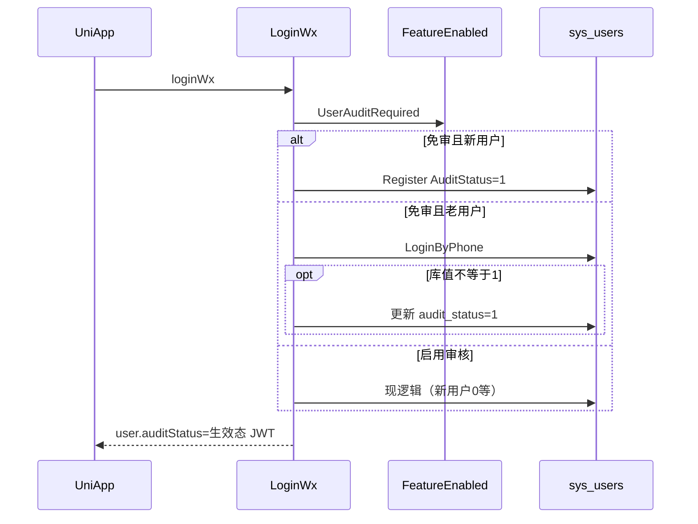
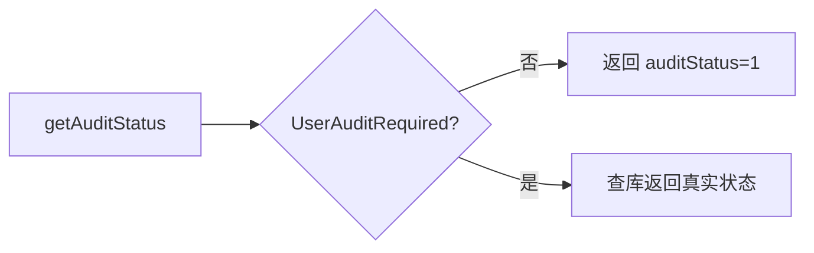

# industry-config — server 设计报告（M0-2 / GEN-03）

> **评审状态**：已通过并实现（M0-2 / GEN-03）。  
> 依赖：**M0-1 已完成**（`common.KeyUserAudit` / `FeatureEnabled`）。总序见 [phase2-module-roadmap.md](../../../phase2-module-roadmap.md)。  
> 同版本小程序端：[../uniapp/design.md](../uniapp/design.md)

## 1. 目标

- 用已有开关 `feature.user_audit` 控制 C 端「用户审核」是否生效（GEN-03）
- **关闭（默认 `0`）**：新注册即为已通过；查询/登录响应中的审核态按「已通过」生效，小程序可直接加购下单
- **开启（`1`）**：保持现网小 B 行为（新用户多为待填/待审，未通过前前端拦截购买）
- 不删除 `audit_status` 字段与管理端审核能力

## 2. 现状分析

- 微信登录注册：[`LoginWx`](../../../../server/service/system/sys_user.go) 新用户分支写 `AuditStatus: user.AuditStatus`，此时 `user` 多为 nil 语义，实际落库默认 **`0`**
- JWT / 登录响应带真实 `AuditStatus`；[`GetAuditStatus`](../../../../server/api/v1/system/sys_user.go) 原样返回库值
- **下单 Service 不校验** `audit_status`；拦截主要在 UniApp（加购提示「审核通过后才可以下单」）
- M0-1 已种子 `feature.user_audit=0`，但业务未读该键

## 3. 数据模型与接口

### 数据模型

无新表。继续使用：

| 资源 | 说明 |
|------|------|
| `sys_config.name = feature.user_audit` | `0` 关 / `1` 开（M0-1） |
| `sys_users.audit_status` | 库内真实状态保留；关开关时对 C 端暴露「生效状态」 |

| 决策 | 理由 |
|------|------|
| 关开关时不强制全表 UPDATE 为 1 | 避免一次大迁移；用「生效态」覆盖读路径即可；登录时可顺带回写当前用户为 1（可选增强，见流程） |
| 开开关后历史已被回写为 1 的用户 | 仍为通过，符合「曾按 B2C 使用」；若客户要重新审核需人工改库/后台，本版不做批量打回 |

### 接口契约

不新增路由。行为变更：

| 入口 | 关 `feature.user_audit` | 开 |
|------|-------------------------|-----|
| `LoginWx` → 新用户 `Register` | 显式 `AuditStatus = 1` 入库 | 显式 `AuditStatus = 0`（或保持现默认 0，禁止再依赖未初始化字段） |
| `LoginWx` → 已存在用户 | 响应与 JWT claims 中生效态为 `1`；若库值 ≠1，**建议**登录成功时回写 `audit_status=1`（仅当前用户一行） | 不改写；返回库值 |
| `GET .../getAuditStatus` | 响应 `auditStatus` 固定按生效态 **`1`**（可仍返回库内 remark，或一并忽略） | 返回库值 |
| 管理端改用户审核 | 仍可改库字段 | 同左 |
| `CreateOrder` 等 | **本版仍不增加**审核校验 | 同左（与现网一致；购买门禁仍以前端 + 生效态为准） |

读取开关：

```text
common.FeatureEnabled(common.KeyUserAudit, false)
// true = 启用审核；false = B2C 免审
```

建议抽私有/包内辅助（骨架留给 tasks）：

```text
EffectiveAuditStatus(u *SysUser) int8
// 免审 → 1；启用审核 → u.AuditStatus
UserAuditRequired() bool  // FeatureEnabled(KeyUserAudit, false)
```

## 4. 核心流程

### 4.1 微信登录（免审）



### 4.2 GetAuditStatus（免审）



### 4.3 边界

- `userId==0`：现逻辑返回 0；免审下未登录仍不应伪造成已通过（保持 0 或不鉴权失败）
- 管理端账号：本切片只保证 **小程序 LoginWx / getAuditStatus** 路径；后台管理员审核列表逻辑不动
- 配置中途从关→开：已为 `1` 的用户仍可通过；仍为 `0/2/3/4` 的按真实状态拦截（与现网一致）

## 5. 项目结构与技术决策

```text
server/
  service/common/feature_config.go     # 已有 KeyUserAudit（可加 UserAuditRequired 薄封装）
  service/system/sys_user.go           # LoginWx 注册默认态；可选登录回写
  api/v1/system/sys_user.go            # GetAuditStatus 生效态；TokenNext 前可规范化 user.AuditStatus
```

| 决策 | 方案 | 理由 |
|------|------|------|
| 生效态优先改读路径 | GetAuditStatus + 登录响应 | 前端门闩依赖 `=== 1`，改后端即可大幅生效 |
| 登录回写当前用户 | 免审且库≠1 时 UPDATE | 减少「库 0、响应 1」长期分裂；非全表迁移 |
| 订单不加审核校验 | 与现网一致 | 避免本切片扩大到履约；门禁已在 C 端 |

## 6. 暂不实现

| 功能 | 理由 |
|------|------|
| 管理端开关 UI（M0-3） | 可用现有 sysConfig CRUD 改键 |
| CreateOrder 强制校验审核 | 现网无；避免行为突变；若要做另开切片 |
| 全表历史用户批量改 audit_status | 用生效态 + 登录回写足够 |
| AUTH-01 / AUTH-02 | 独立切片 |
| 删除会员资料/审核相关 API | 开开关时仍要用 |

---

**下一步**：评审通过后同目录 `tasks.md`，并与 uniapp design 一并实现。
