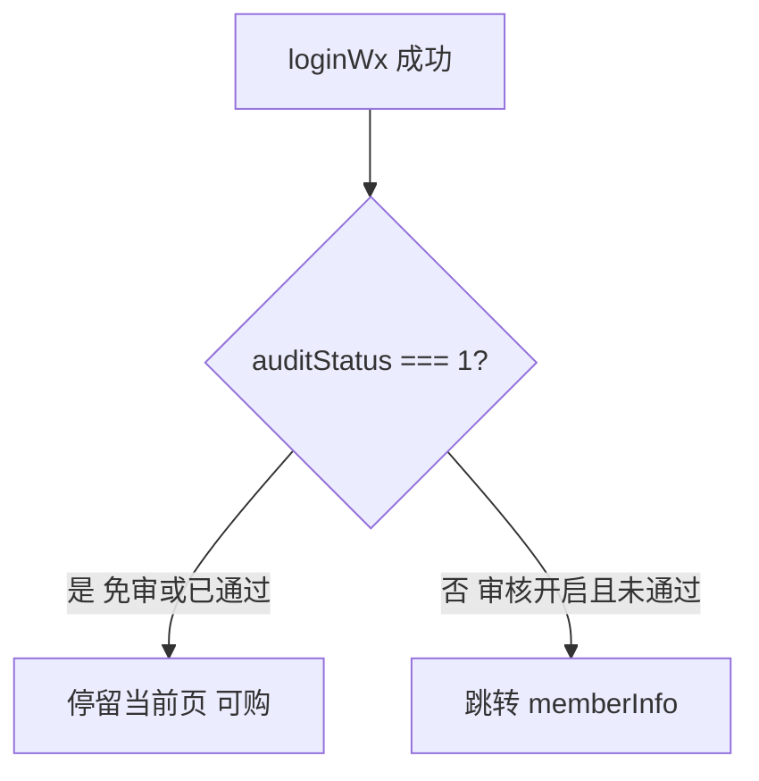

# industry-config — uniapp 设计报告（M0-2 / GEN-03）

> **评审状态**：已通过并实现（M0-2 / GEN-03）。  
> 依赖：同版本 [server/design.md](../server/design.md)（免审时登录/`getAuditStatus` 生效态为 `1`）。  
> 总序见 [phase2-module-roadmap.md](../../../phase2-module-roadmap.md)。

## 1. 目标

- 在 **server 免审已返回 `auditStatus=1`** 的前提下，保证小程序主路径：登录后可浏览价格、加购、下单，**不再被强制赶去填企业资料**
- 审核**开启**时：保持现有拦截与资料页流程
- 本版以「少改前端、信任服务端生效态」为主；不做完整功能开关配置页

## 2. 现状分析

- [`loginPop`](../../../../uniapp/components/loginPop/loginPop.vue)：登录成功若 `auditStatus !== 1` → `navigateTo` `/pages/my/memberInfo`
- 商品详情等：`isAudit === false` 时加购提示「审核通过后才可以下单！」并跳转资料页
- 列表组件 [`goodsList`](../../../../uniapp/components/goodsList/goodsList.vue) 用 `is-audit` 控制价格区展示
- 未读 `feature.user_audit`；完全依赖用户对象 / `getUserAuditStatus`

结论：server 免审修好后，**多数页面会自动变通**；仍需排查缓存了旧 `auditStatus=0` 的本地 user、以及资料页是否多余打扰。

## 3. 数据模型与接口

### 前端状态

| 数据 | 说明 |
|------|------|
| `storage` 中 user.auditStatus | 以最近一次登录 / getUserAuditStatus 为准 |
| 本版可不本地缓存 feature 开关 | 避免双源；特殊 UI 见下 |

### 接口

| 接口 | 用法 |
|------|------|
| 现有 `loginWx` | 使用返回的 `user.auditStatus`（免审应为 1） |
| 现有 `getUserAuditStatus` | 刷新 `isAudit`；免审应为 1 |
| （可选）`findSysConfigByName?name=feature.user_audit` | 仅用于隐藏「会员审核资料」入口；非必须 |

无新业务 API。

## 4. 核心流程

### 4.1 登录后（免审）



与现逻辑相同；免审时走「是」分支。

### 4.2 加购门闩

保持 `if (!isAudit) { toast + memberInfo }`；免审下 `isAudit` 应为 true。  
**补充**：`onShow` 时若已登录且本地 `auditStatus!==1`，应再调一次 `getUserAuditStatus` 刷新（防止旧缓存挡住免审）——在已有拉状态逻辑的页面核对是否覆盖详情/分类/列表；缺则补一处公共方法（tasks 定）。

### 4.3 会员资料页（建议）

| 场景 | 行为 |
|------|------|
| 免审 | 可不强制进入；若用户手动打开，展示普通资料即可，弱化「等待审核」主流程（最小改：免审用户少被 navigate 进来即可） |
| 审核开 | 维持提交/等待/拒绝文案 |

本版 **不要求**大改 `memberInfo.vue` 表单；以「不再误跳」为验收主标准。

## 5. 项目结构与技术决策

```text
uniapp/
  components/loginPop/loginPop.vue     # 确认跳转条件依赖服务端状态即可
  pages/goods/detail.vue 等            # isAudit 刷新；必要时抽 util
  store/storage                        # 登录后写入最新 user
```

| 决策 | 方案 | 理由 |
|------|------|------|
| 前端不强制再读开关 | 信任 GetAuditStatus/登录 | 改动面小，与 server 单一真相 |
| 可选读开关藏入口 | 仅体验优化 | 可放入「暂不实现」或 tasks 可选子任务 |

## 6. 暂不实现

| 功能 | 理由 |
|------|------|
| 小程序内开关设置页 | 属运营配置，走管理端 M0-3 |
| 重写整套会员企业资料 | 审核开时仍需要 |
| 去掉所有 isAudit 判断 | 审核开时仍要门闩 |
| 管理端 web | 本版无 web design |

---

**过关（与 roadmap 对齐）**：`feature.user_audit=0` 时新用户登录后可加购下单；改为 `1` 后未通过用户再次被拦截。
