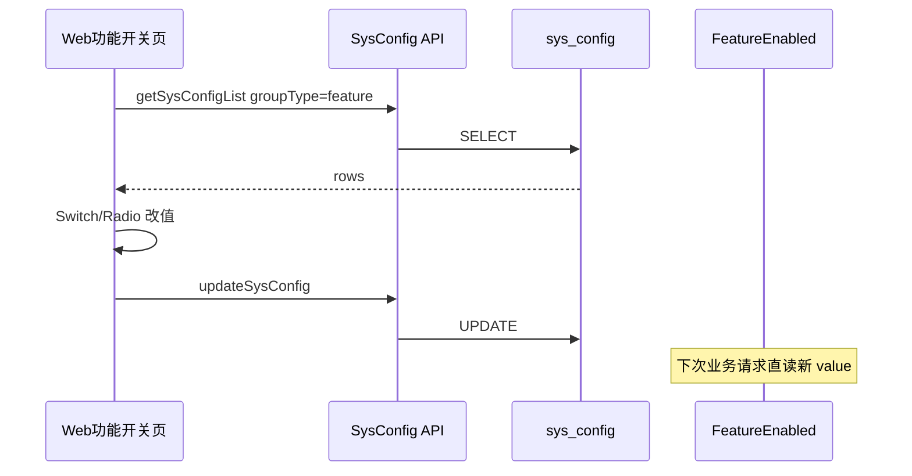

# industry-config — web 设计报告（M0-3 管理端开关）

> **评审状态**：已通过并实现（2026-08-12）。  
> 前置：[v0.1.0](../v0.1.0/server/design.md) 键约定、[v0.2.0](../v0.2.0/server/design.md) 审核开关接入。  
> 总序：[phase2-module-roadmap.md](../../../phase2-module-roadmap.md) **M0-3**。

## 1. 目标

- 管理端提供 **「功能开关」** 专用页，用语义化控件改 `feature.*`，无需在「配置参数」里手改键值
- 覆盖 M0-1 三键：`feature.user_audit`、`feature.settle_month`、`feature.courier_mode`
- 改完即写库；业务下次读 `Feature*` 生效（本版不引入缓存）
- 复用现有 Private `sysConfig` CRUD，**不新增后端 API**

## 2. 现状分析

- 已有「超级管理员 → 配置参数」通用 CRUD（`sysConfig.vue`），可改任意键，但对运营不友好
- `feature.*` 已种子，`FeatureEnabled` / `FeatureString` 直读 DB；审核开关 M0-2 已生效
- 缺口：无专用开关 UI；运营易改错键/值；月结与物流模式键尚无业务消费，但本页可先占位编辑

## 3. 数据模型与接口

### 数据模型（前端）

| 状态 | 说明 |
|------|------|
| `rows` | `getSysConfigList({ groupType: 'feature' })` 返回的配置行 |
| 表单展示 | 按 `name` 映射：审核/月结用 Switch（value `0`/`1`）；物流用 Radio（`delivery`/`courier`） |

| 决策 | 理由 |
|------|------|
| 不新建 feature 表/API | 现有 CRUD + Casbin 已够 |
| 专用页而非改通用表 | 语义控件 + 文案说明，降低误操作 |
| 按 `group_type=feature` 拉取 | 与种子一致，后续加键可同页展示兜底 |

### 接口契约

| 方法 | 路径 | 用途 |
|------|------|------|
| GET | `/sysConfig/getSysConfigList?groupType=feature&page=1&pageSize=50` | 拉开关行 |
| PUT | `/sysConfig/updateSysConfig` | 写回整行（含 id/name/value/status） |

鉴权：现有 JWT + Casbin（与配置参数相同）。无新错误码。

## 4. 核心流程



边界：

| 场景 | 行为 |
|------|------|
| 某键缺失 | 页内提示执行 M0-1 种子 SQL；不自动 INSERT（避免权限/重复逻辑） |
| `status≠1` | 提示「配置已禁用」；本版开关页只改 value，不代开 status（或保存时强制 status=1，见 tasks） |
| 并发改同一键 | 后写覆盖；可接受 |

## 5. 项目结构与技术决策

```text
web/src/view/superAdmin/featureConfig/featureConfig.vue   # 新建开关页
web/src/api/sysConfig.js                                  # 复用，无需新接口
sql/migrations/20260812_industry_config_m0_3_menu.sql     # 菜单 + 赋权 888
```

| 决策 | 方案 | 理由 |
|------|------|------|
| 菜单位置 | 超级管理员下，靠近「配置参数」 | 同属运营配置 |
| 菜单注入 | 幂等 SQL | 与 M0-1 迁移风格一致；也可后台菜单管理手工加 |
| 月结/物流 UI | 可编辑但文案标明「业务后续切片接入」 | 避免运营以为已全链路生效 |

## 6. 暂不实现

| 功能 | 理由 |
|------|------|
| 新 Server API / 批量保存 | 现有 update 足够 |
| Redis 缓存配置 | Feature* 仍直读 |
| 月结/快递真实业务分支 | M2 / M4 |
| uniapp 开关页 | 运营配置走管理端 |
| PAY-04/05 | 支付另议，本版不做 |

---

## 过关标准

1. 后台菜单可进「功能开关」页，看到三键当前值  
2. 改 `feature.user_audit` 后，C 端审核行为与 M0-2 一致（开/关）  
3. 改值后「配置参数」列表同源可见  

**下一步**：同目录 `tasks.md` → 编码。
