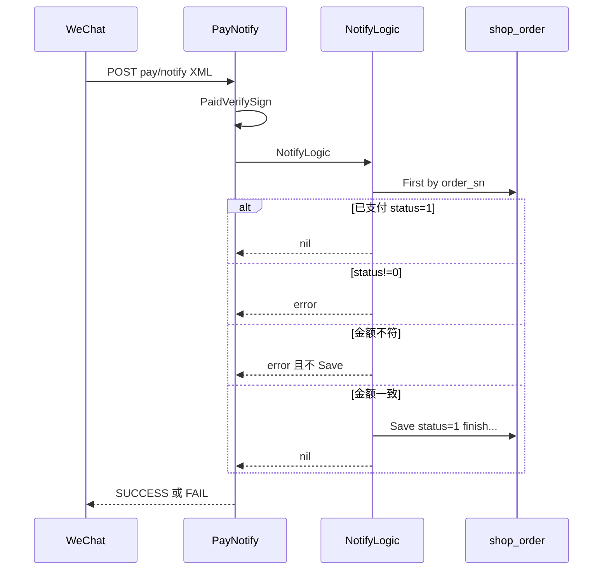

# payment — server 设计报告（M1-1 / PAY-02）

> **评审状态**：已通过并实现（M1-1 / PAY-02）。  
> 切片：阶段二 **M1-1** — 支付回调金额与订单金额校验。总序见 [phase2-module-roadmap.md](../../../phase2-module-roadmap.md)。  
> 对照：[payment-reliability.md](../../../payment-reliability.md)、[03a-order-pay.md](../../../03a-order-pay.md)、[todo-gaps.md](../../../todo-gaps.md) PAY-02。

## 1. 目标

- 在微信支付异步回调入账前，校验通知金额与本地订单应付金额一致
- **不一致**：不把订单改为已支付；打错误日志（含订单号、期望分、实付分）；向微信返回失败（与现有 `NotifyLogic` error → `FAIL` 一致）
- **一致**：保持现有入账字段写入逻辑（本切片不改幂等/流水/查单）
- 兼容 `wechatPay.debug`：预下单打成 1 分时，校验期望亦为 1 分

## 2. 现状分析

- 路径：`POST /wechat/pay/notify` → 验签 → [`NotifyLogic`](../../../../server/service/wechat/wechat.go)
- 现逻辑：按 `out_trade_no`（`order_sn`）找单；已 `status=1` 直接成功；仅允许 `status=0`；把 `TotalFee`（分）转元写入 `finish` 后 `Save` 整单为已支付
- **缺口**：从未比较 `req.TotalFee` 与 `order.total`（PAY-02）
- 下单预支付：`JSAPIPay` 中 `TotalFee = amount*100`（分）；`wechatPay.debug=true` 时强制 `TotalFee="1"`

## 3. 数据模型与接口

### 数据模型

无表结构变更。使用现有：

| 字段 | 用途 |
|------|------|
| `shop_order.order_sn` | 对应回调 `OutTradeNo` |
| `shop_order.total` | 订单应付金额（元，decimal/float） |
| `shop_order.status` | `0` 待付 / `1` 已付 |
| `notify.PaidResult.TotalFee` | 微信实付（**分**，整型） |

| 决策 | 理由 |
|------|------|
| 用「分」整数比较 | 避免浮点误差；与微信 `TotalFee` 单位一致 |
| 期望分：`round(order.Total * 100)` | 与下单 `fmt.Sprintf("%.0f", amount*100)` 对齐；实现时统一同一舍入方式 |
| debug 时期望分固定为 `1` | 与 `JSAPIPay` debug 分支一致，否则本地联调必失败 |

### 接口契约

不新增 HTTP 路由。行为变更仅在 `NotifyLogic`（及可选抽出的纯函数便于单测）：

| 步骤 | 成功 | 金额不符 |
|------|------|----------|
| 查单 / 状态门闩 | 同现网 | — |
| **金额校验（新增）** | 继续写 finish / status=1 | `error`；**不**改订单；日志 Error |
| `PayNotify` | `SUCCESS` | `FAIL`（沿用现有 error 分支） |

建议内部函数（tasks 实现）：

```text
ExpectedPayFen(order *shop.Order, debug bool) int64
NotifyAmountMatches(order *shop.Order, totalFeeFen int64, debug bool) bool
```

无新对外错误码（微信 XML 回包仍为 FAIL + 文案）。

## 4. 核心流程



### 边界

| 场景 | 行为 |
|------|------|
| `TotalFee` 空/nil | 视为校验失败，打日志，返回 error |
| 订单 `total` 异常（负、NaN） | 校验失败 |
| 已支付后再回调 | 仍直接成功，**不再**做金额校验（避免历史脏数据卡重试；可选后续增强） |
| 金额不符导致微信重试 | 可接受；须靠日志告警人工介入；本版不做企业微信告警通道 |
| 积分/月结直通 `status=1` | 不走本回调路径，无影响 |

## 5. 项目结构与技术决策

```text
server/
  service/wechat/wechat.go           # NotifyLogic 插入校验；JSAPIPay debug 语义对齐
  service/wechat/pay_amount.go       # 可选：期望分/比较纯函数（便于单测）
  service/wechat/pay_amount_test.go  # 单测：元↔分、debug、不符
```

| 决策 | 方案 | 理由 |
|------|------|------|
| 只做校验，不做流水表 | 留给 M1-2（PAY-03） | 切片边界 |
| 不做条件更新/查单 | 留给 M1-2 / M1-3 | 同左 |
| 不符回 FAIL | 与现 error 处理一致；防止错账入账 | 风控优先于「停重试」 |
| 单测覆盖比较函数 | 不依赖真实微信 | 可 CI |

## 6. 暂不实现

| 功能 | 理由 |
|------|------|
| 支付流水表 / 幂等条件更新 | **M1-2** |
| 主动查单补单 | **M1-3** |
| 超时关单、退款 | M2 / 其它切片 |
| 管理端「同步支付状态」 | P1 |
| 企微/邮件告警通道 | P2；本版 Error 日志即可 |
| 修改预下单金额算法 | 只对齐校验，不改计价 |
| uniapp / web | 本切片仅 server 回调 |

---

**过关标准（roadmap）**：金额不符拒写已支付；有明确错误日志；金额一致时原支付成功路径仍通（含 debug 1 分）。

**下一步**：评审通过后同目录 `tasks.md` 再编码。
