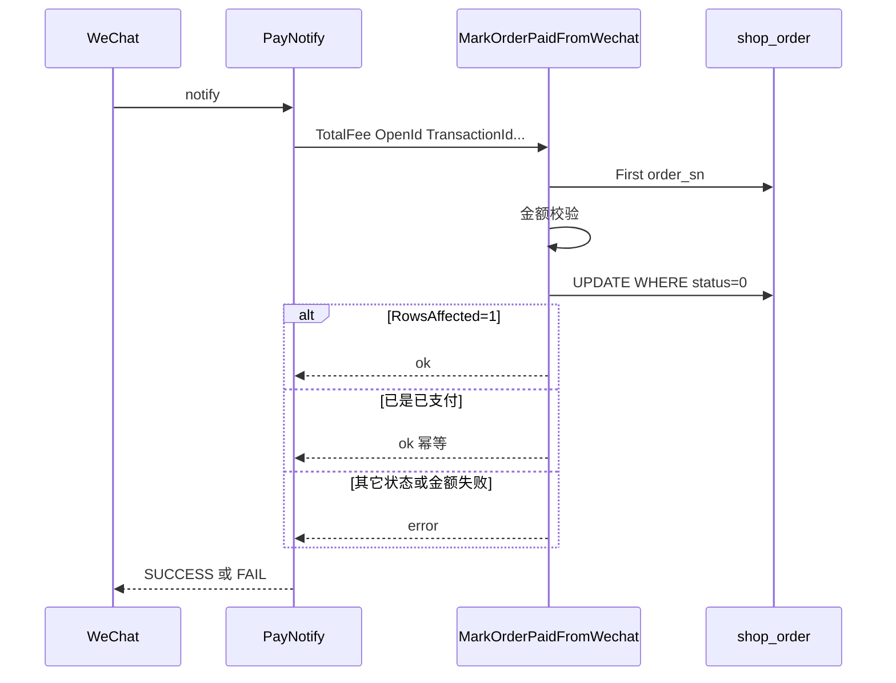
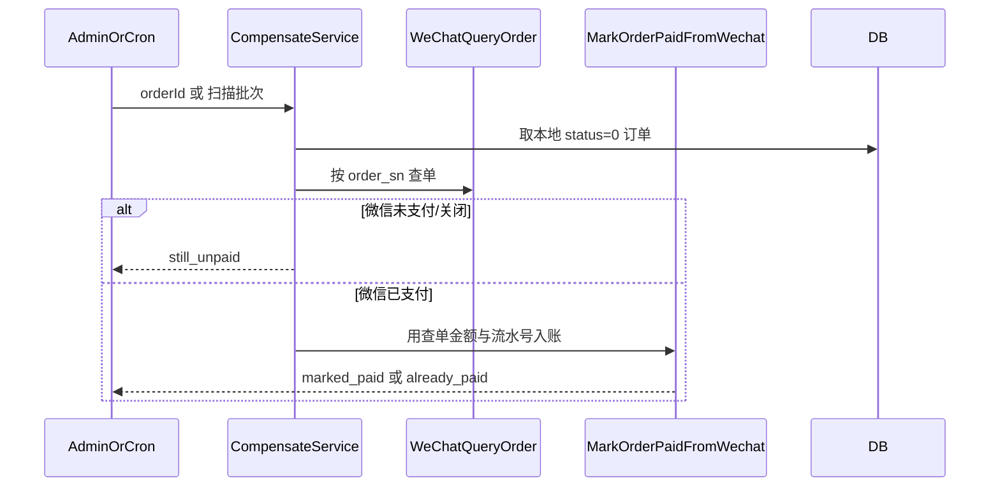

# payment — server 设计报告（PAY-03 条件更新幂等 + PAY-01 掉单查单）

> **评审状态**：已通过并实现（2026-08-12）。  
> 本版将原路线图 **M1-2（PAY-03 条件更新部分）** 与 **M1-3（PAY-01）** 合并交付，适配单商户中小商城「资金安全 vs 复杂度」平衡。  
> 已完成前置：[v0.1.0](../v0.1.0/server/design.md) 金额校验（PAY-02）。  
> 对照：[payment-reliability.md](../../../payment-reliability.md)、[todo-gaps.md](../../../todo-gaps.md)。  
> 查单配置见 `wechatPay.compensate`（含 `maxQueryPerOrder` / `mock` / `adminSyncEnable`）。

## 1. 目标

- **PAY-03（轻量）**：支付入账改为「条件更新」——仅当 `status=0` 时写入已支付；并发/重复回调安全；**不新建支付流水表**
- **PAY-01**：本地长期 `status=0` 的订单，可通过 **微信查单** 确认已支付后，走与回调相同的入账逻辑补状态（掉单补偿）
- 抽出统一 **MarkOrderPaid**（或等价）入账函数：回调与查单补单共用，避免两套写库逻辑
- 提供两条补偿入口：**管理端一键同步**（救急）+ **轻量定时扫描**（自动兜底）
- 保持系统简单：无对账中台、无流水表、无企微告警中台

## 2. 现状分析

- 回调 [`NotifyLogic`](../../../../server/service/wechat/wechat.go)：先读后 `Save` 整单；已支付短路；已有金额校验（M1-1）
- **缺口**：无 `UPDATE ... WHERE status=0`，极端并发下可能竞态（PAY-03）；无查单补单，回调丢失则订单一直未付（PAY-01）
- 预支付 `OutTradeNo = order_sn`，查单可按商户订单号查询
- 工程已有 `timer`（robfig/cron）基础设施，当前用于清表，可挂一条支付扫描任务
- 产品定位：单商户独立部署；客服可进微信商户平台核对；首期允许人工退款

## 3. 数据模型与接口

### 数据模型

**无新表。** 继续使用 `shop_order` 现有字段：

| 字段 | 本版用途 |
|------|----------|
| `order_sn` | 商户订单号 = 微信 `out_trade_no` |
| `status` | `0` 待付 → `1` 已付（条件更新） |
| `finish` / `pay_time` / `payment_openid` / `transation_id` / `payment_info` | 入账写入 |

| 决策 | 理由 |
|------|------|
| 不做支付流水表 | 中小店对账可先靠订单字段 + 商户平台；流水留后续版本 |
| 条件更新代替悲观锁 | 实现简单、足够防并发双入账 |
| 回调与查单共用入账函数 | 金额校验、字段写入、条件更新只维护一处 |

### 入账契约（内部）

```text
MarkOrderPaidFromWechat(input):
  - orderSn, totalFeeFen, payTime, openId, transactionId, attach
  - 查单 → 状态门闩 → 金额校验（复用 M1-1）
  - UPDATE shop_order SET status=1, finish=..., pay_time=..., ...
      WHERE order_sn=? AND status=0
  - RowsAffected==0：若已是 status=1 → 幂等成功；否则失败（状态不允许）
```

`NotifyLogic` 改为组装 input 后调用上述函数。

### HTTP 接口

| 鉴权 | 方法/路径（示意） | 用途 |
|------|-------------------|------|
| 现有 Public | `POST /wechat/pay/notify` | 行为变为条件更新入账；对外路径不变 |
| Private（管理端） | `POST /order/syncWechatPay`（或 `/order/compensatePay`） | body：`{ "orderId" }` 或 `{ "orderSn" }`；查微信并尝试补单 |

响应（管理端同步）：

```json
{
  "code": 0,
  "data": {
    "localStatus": 1,
    "wechatTradeState": "SUCCESS",
    "action": "marked_paid" | "already_paid" | "still_unpaid" | "amount_mismatch"
  },
  "msg": "..."
}
```

错误：订单不存在、非待支付、微信查单失败、金额不符等，返回明确 msg。

### 定时任务

| 配置 | 说明 |
|------|------|
| `wechatPay.compensate.enable` | 定时扫描总开关；**测试建议 `false`**，生产按需打开 |
| `wechatPay.compensate.spec` | 如 `@every 5m` |
| `wechatPay.compensate.minAgeMinutes` | 仅扫描创建超过 N 分钟仍 `status=0` 的单 |
| `wechatPay.compensate.batchSize` | 每轮上限，避免打爆微信 |
| `wechatPay.compensate.maxQueryPerOrder` | 单笔进程内最多查微信次数；`0`=不限制 |
| `wechatPay.compensate.mock` | `true` 时不调微信，查单视为未支付（测流程） |
| `wechatPay.compensate.adminSyncEnable` | 是否开放管理端 `syncWechatPay` |

扫描条件：`status=0 AND (status_cancel=0 OR NULL) AND created_at < now()-minAge`，按创建时间升序。

## 4. 核心流程

### 4.1 回调入账（PAY-03）



### 4.2 掉单查单补单（PAY-01）



### 4.3 边界

| 场景 | 行为 |
|------|------|
| 回调与补单同时成功 | 条件更新保证只有一次真正写入；另一次幂等成功 |
| 微信已付但金额与 `order.total` 不符 | 不入账；打 Error 日志；管理端返回 `amount_mismatch` |
| 本地已取消（`status_cancel!=0`）且微信已付 | **本版不自动入账、不自动退款**；日志告警，人工处理（避免静默错账）；写入 design 红线 |
| debug 1 分 | 与 M1-1 相同，查单补单也走 debug 期望分 |
| 微信 API 限频/失败 | 本轮跳过该单并打日志；下轮或人工再试 |
| 积分/月结已直接 status=1 | 不在扫描集合内 |

## 5. 项目结构与技术决策

```text
server/
  service/wechat/wechat.go              # NotifyLogic 改为调 Mark*
  service/wechat/pay_mark.go            # MarkOrderPaidFromWechat（新建）
  service/wechat/pay_query.go           # 封装微信查单（新建）
  service/wechat/pay_compensate.go      # 单笔补偿 + 批量扫描（新建）
  api/v1/shop/order.go                  # syncWechatPay
  router/shop/order.go                  # 注册 Private 路由
  initialize/timer.go 或支付专用 init    # 注册 compensate cron
  config / config.example.yaml          # wechatPay.compensate.*
```

管理端 web（可选同版或紧随）：订单详情/列表增加「同步支付状态」按钮，调上述 API。若本版只做 server，web 可列为「暂不实现」并由接口文档支持 Postman。

| 决策 | 方案 | 理由 |
|------|------|------|
| PAY-03 只做条件更新 | 无流水表 | 复杂度低，覆盖并发安全 |
| 查单与回调共用 Mark | 单一入账路径 | 避免补单漏金额校验 |
| 定时 + 管理端双入口 | 自动兜底 + 客服救急 | 中小店最实用 |
| 已取消且微信已付不自动处理 | 人工 | 避免错误发货；自动退款属 PAY-05 |
| 扫描加 minAge / batchSize | 限流 | 保护微信配额与本机负载 |

| 依赖 | 用途 | 已有/需新增 |
|------|------|-------------|
| silenceper wechat pay 查单 API | QueryOrder | 需对接（库内已有 WxPay） |
| robfig/cron / global.Timer | 定时扫描 | 已有 |
| M1-1 pay_amount | 金额校验 | 已有 |

## 6. 暂不实现

| 功能 | 理由 |
|------|------|
| 独立支付流水表 / 原始回调落库 | 刻意简化；对账靠订单字段 + 商户平台 |
| 微信自动退款、超时关单回库存 | PAY-05 / PAY-04；合同可写人工 |
| 已取消 + 微信已付的自动退款/工单系统 | 仅日志 + 人工 |
| 企微/邮件告警中台 | Error 日志足够 |
| 多支付通道统一对账 | 主路径仅微信 |
| 全库金额改 decimal | 另议题 |
| （可选）管理端按钮 UI | 可本版只交 API；UI 下一切片 |

---

## 过关标准

1. 并发双回调：订单最终只成功入账一次；第二次幂等成功且回微信 SUCCESS  
2. 金额不符：条件更新不执行，订单保持待付  
3. 模拟「本地未付、微信已付」：管理端同步或定时任务可将订单补为已付，且金额校验生效  
4. 已取消订单：补单不自动改已付（本版）  

**下一步**：已完成，见 [tasks.md](./tasks.md)。
